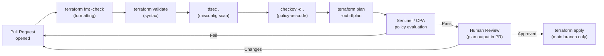

# Terraform — Hardening


<div class="kb-summary">
Hardening reference covering Security Scanning Pipeline, Dependency and Provider Security, Hardening Checklist.
</div>

## Security Scanning Pipeline


```
┌──────────────────────────────────────── Terraform — Hardening ────────────────────────────────────────┐
│   ┌───────────────────────────────────────────────────────────────────────────────────────────────┐   │
│   │  Terraform hardening: secure state backend, restrict apply access, scan configs, pin versions │   │
│   │   S3 bucket hardening: Block Public Access, versioning, SSE-KMS, access logging, MFA delete   │   │
│   │      CI hardening: plan only on PR, apply only on main, required approval gate, audit log     │   │
│   └───────────────────────────────────────────────────────────────────────────────────────────────┘   │
│                                                                                                       │
│   ┌──────────────────────────────────────────────┐  ┌─────────────────────────────────────────────┐   │
│   │           State Backend Hardening            │  │               Config Hardening              │   │
│   │          S3: Block Public Access on          │  │            Pin: required_version            │   │
│   │            S3: SSE-KMS encryption            │  │       Pin: required_providers versions      │   │
│   │            S3: versioning enabled            │  │         checkov: block PR on failure        │   │
│   │            DynamoDB: IAM restrict            │  │             tfsec / tflint in CI            │   │
│   │        CloudTrail on S3 state bucket         │  │          No local state file in git         │   │
│   └──────────────────────────────────────────────┘  └─────────────────────────────────────────────┘   │
│                                                                                                       │
│   ┌───────────────────────────────────────────────────────────────────────────────────────────────┐   │
│   │     MFA delete      = S3 bucket MFA Delete protection; prevents accidental state deletion     │   │
│   │       tfsec           = open-source IaC security scanner; similar to checkov; check both      │   │
│   │       CloudTrail on S3= logs every GetObject/PutObject on state bucket; full audit trail      │   │
│   └───────────────────────────────────────────────────────────────────────────────────────────────┘   │
└───────────────────────────────────────────────────────────────────────────────────────────────────────┘
```

## Dependency and Provider Security

```bash
# Lock provider versions to prevent unexpected upgrades
terraform providers lock

# Review the lock file for unexpected version changes
git diff .terraform.lock.hcl

# Verify provider checksums after init
cat .terraform.lock.hcl | grep -A5 "provider"

# Use version constraints to limit provider versions
# versions.tf
terraform {
  required_providers {
    aws = {
      source  = "hashicorp/aws"
      version = "~> 5.0"   # allows patch updates only within 5.x
    }
  }
  required_version = ">= 1.5.0"
}
```

## Hardening Checklist

| Area | Practice |
|---|---|
| Static analysis | Run `tfsec` or `checkov` in CI before every plan |
| Policy enforcement | Use Sentinel or OPA to enforce tagging and compliance rules |
| Provider versions | Lock with `terraform providers lock`; review changes in PRs |
| Sensitive outputs | Mark with `sensitive = true`; review plan output for exposed secrets |
| State access | Restrict state bucket to the Terraform automation role |
| `.gitignore` | Exclude `*.tfvars`, `*.tfstate`, `*.tfstate.backup`, `.terraform/` |
| Code review | All Terraform PRs reviewed before apply; plan output included |
| Audit logs | Enable CloudTrail / Azure Monitor for all provider API calls |
