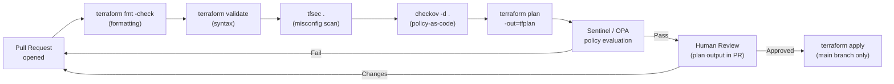

# Terraform — Hardening

## Security Scanning Pipeline



## Policy Enforcement with Sentinel / OPA

```hcl
# Example Sentinel policy — enforce required tags on all resources
import "tfplan/v2" as tfplan

required_tags = ["Owner", "Environment", "CostCenter"]

# Check all resources in the plan
violations = filter tfplan.resource_changes as _, rc {
    rc.mode is "managed" and
    rc.change.actions contains "create" and
    any required_tags as tag {
        not (tag in keys(rc.change.after.tags else {}))
    }
}

main = rule { length(violations) == 0 }
```

```bash
# Open Policy Agent — evaluate a Terraform plan against policy
terraform plan -out=tfplan
terraform show -json tfplan > plan.json
opa eval --data policy.rego --input plan.json "data.terraform.deny"
```

## Dependency and Provider Security

```bash
# Lock provider versions to prevent unexpected upgrades
terraform providers lock

# Review the lock file for unexpected version changes
git diff .terraform.lock.hcl

# Verify provider checksums after init
cat .terraform.lock.hcl | grep -A5 "provider"

# Use version constraints to limit provider versions
# versions.tf
terraform {
  required_providers {
    aws = {
      source  = "hashicorp/aws"
      version = "~> 5.0"   # allows patch updates only within 5.x
    }
  }
  required_version = ">= 1.5.0"
}
```

## Hardening Checklist

| Area | Practice |
|---|---|
| Static analysis | Run `tfsec` or `checkov` in CI before every plan |
| Policy enforcement | Use Sentinel or OPA to enforce tagging and compliance rules |
| Provider versions | Lock with `terraform providers lock`; review changes in PRs |
| Sensitive outputs | Mark with `sensitive = true`; review plan output for exposed secrets |
| State access | Restrict state bucket to the Terraform automation role |
| `.gitignore` | Exclude `*.tfvars`, `*.tfstate`, `*.tfstate.backup`, `.terraform/` |
| Code review | All Terraform PRs reviewed before apply; plan output included |
| Audit logs | Enable CloudTrail / Azure Monitor for all provider API calls |
