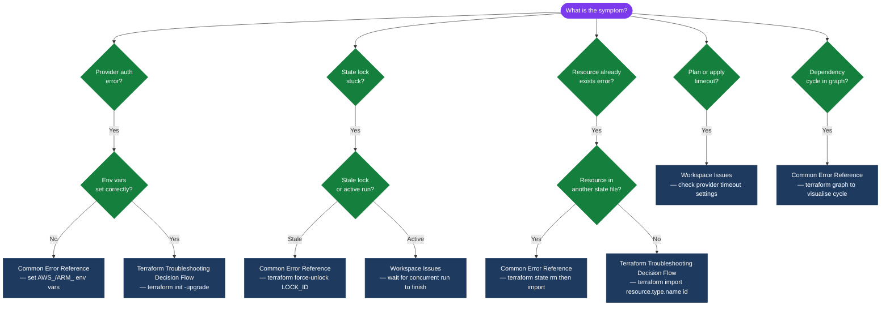
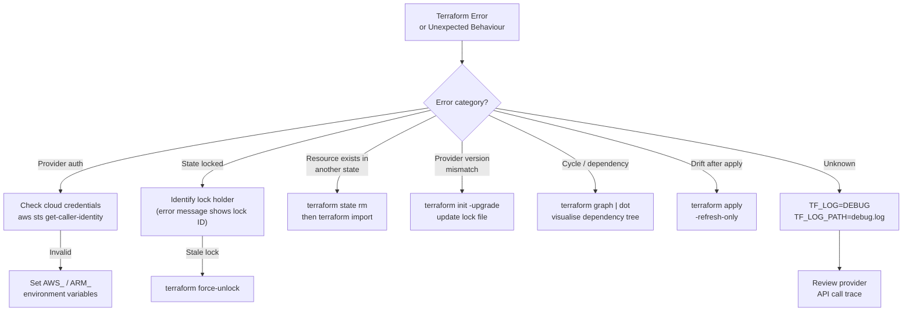

---
tags:
  - terraform
  - troubleshooting
search:
  boost: 1.5
---
# Terraform — Common Issues


<div class="kb-summary">
Common Issues reference covering Terraform Troubleshooting Decision Flow, Refresh and Reconciliation Issues, Workspace Issues, Common Error Reference.

*Applies to: Terraform 1.x*
</div>

## Diagnostic Flow



---

## Before you begin

- **Access:** Provider credentials configured (`terraform login` or env vars)
- **Gather first:** recent error message text, event timestamps, and affected object names
- **Scope:** confirm whether the issue affects a single object, host, cluster, or site
- **Escalation:** open a vendor support ticket before running any destructive step
- **Logging:** document each command and output — required if escalation is needed

---

## Terraform Troubleshooting Decision Flow


```text
┌────────────────────────────────────── Terraform — Common Issues ──────────────────────────────────────┐
│   ┌───────────────────────────────────────────────────────────────────────────────────────────────┐   │
│   │                        Most frequent Terraform failures and their fixes                       │   │
│   └───────────────────────────────────────────────────────────────────────────────────────────────┘   │
│                                                                                                       │
│   ┌───────────────────────────────────────────────────────────────────────────────────────────────┐   │
│   │                             Issue: Error acquiring the state lock                             │   │
│   │   Cause A: previous apply crashed → fix: terraform force-unlock <lock-id> from error message  │   │
│   │      Cause B: concurrent apply running → fix: wait for it to complete; check CI pipeline      │   │
│   └───────────────────────────────────────────────────────────────────────────────────────────────┘   │
│                                                                                                       │
│   ┌───────────────────────────────────────────────────────────────────────────────────────────────┐   │
│   │                        Issue: Error: configuring Terraform AWS Provider                       │   │
│   │           Cause A: no credentials → fix: export AWS_PROFILE or configure OIDC in CI           │   │
│   │        Cause B: wrong region → fix: set region in provider block or AWS_DEFAULT_REGION        │   │
│   └───────────────────────────────────────────────────────────────────────────────────────────────┘   │
│                                                                                                       │
│   ┌───────────────────────────────────────────────────────────────────────────────────────────────┐   │
│   │                             Issue: Error: resource already exists                             │   │
│   │        Fix: identify resource ID from error → terraform import resource.type.name <id>        │   │
│   │  After import: terraform plan should show no changes if config matches the existing resource  │   │
│   └───────────────────────────────────────────────────────────────────────────────────────────────┘   │
└───────────────────────────────────────────────────────────────────────────────────────────────────────┘
```

## Workspace Issues

```bash
# Check current workspace
terraform workspace show

# List all workspaces
terraform workspace list

# Switch workspace
terraform workspace select staging

# Delete a workspace (must not be current; state must be empty)
terraform workspace select default
terraform workspace delete old-workspace

# Workspace-conditional logic in configuration
locals {
  is_production = terraform.workspace == "production"
}

resource "aws_instance" "web" {
  instance_type = local.is_production ? "t3.large" : "t3.micro"
}
```

## Common Error Reference

| Error message | Cause | Fix |
|---|---|---|
| `Error: No valid credential sources found` | AWS credentials missing | Set `AWS_ACCESS_KEY_ID` / configure `~/.aws/credentials` |
| `Error acquiring the state lock` | Concurrent run or stale lock | Wait for other run to finish or force-unlock |
| `Error: Provider configuration not present` | Missing provider block | Add `provider` block or `required_providers` |
| `Error: Reference to undeclared resource` | Typo in resource address | Check spelling; run `terraform state list` |
| `Error: cycle` | Circular dependency between resources | Use `depends_on` carefully; restructure dependencies |
| `Error: expected ... to be a string, got ...` | Variable type mismatch | Check `type` constraints in variable declarations |

---

## Verify resolution

- Confirm the original symptom no longer occurs
- Check logs for any residual errors related to the issue
- Monitor for 10–15 minutes to confirm the fix is stable

---

## See also

- [Terraform — Diagnostics](../diagnostics/)
- [Terraform — Escalation](../escalation/)
- [Terraform — Health Checks](../../operations/health-checks/)
