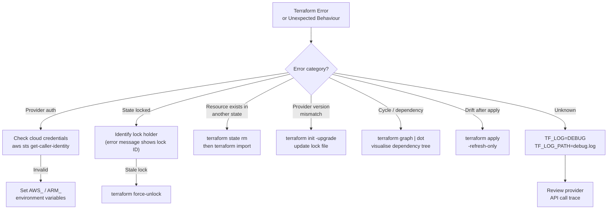

# Terraform — Common Issues

## Terraform Troubleshooting Decision Flow


```

## State Conflicts and Errors

```bash
# Error: state locked by another process
# Get the lock ID from the error message, then force-unlock
terraform force-unlock <LOCK_ID>

# Error: state file is corrupt or incompatible
# Pull the state and inspect it
terraform state pull > current.tfstate
cat current.tfstate | jq '.version, .terraform_version'

# Error: resource already exists in another state
# Remove from state and re-import under the correct address
terraform state rm aws_instance.duplicate
terraform import aws_instance.web01 i-0abc1234

# Error: inconsistent result after apply
# Usually a provider bug — re-run plan to confirm real state
terraform refresh
terraform plan
```

## Refresh and Reconciliation Issues

```bash
# Manually refresh state from real infrastructure
terraform apply -refresh-only

# Inspect what refresh would change
terraform plan -refresh=true

# Skip refresh when you know state is accurate (speeds up plan)
terraform plan -refresh=false

# Debug specific resource attributes
terraform state show aws_instance.web01 | grep -i subnet
```

## Workspace Issues

```bash
# Check current workspace
terraform workspace show

# List all workspaces
terraform workspace list

# Switch workspace
terraform workspace select staging

# Delete a workspace (must not be current; state must be empty)
terraform workspace select default
terraform workspace delete old-workspace

# Workspace-conditional logic in configuration
locals {
  is_production = terraform.workspace == "production"
}

resource "aws_instance" "web" {
  instance_type = local.is_production ? "t3.large" : "t3.micro"
}
```

## Common Error Reference

| Error message | Cause | Fix |
|---|---|---|
| `Error: No valid credential sources found` | AWS credentials missing | Set `AWS_ACCESS_KEY_ID` / configure `~/.aws/credentials` |
| `Error acquiring the state lock` | Concurrent run or stale lock | Wait for other run to finish or force-unlock |
| `Error: Provider configuration not present` | Missing provider block | Add `provider` block or `required_providers` |
| `Error: Reference to undeclared resource` | Typo in resource address | Check spelling; run `terraform state list` |
| `Error: cycle` | Circular dependency between resources | Use `depends_on` carefully; restructure dependencies |
| `Error: expected ... to be a string, got ...` | Variable type mismatch | Check `type` constraints in variable declarations |
