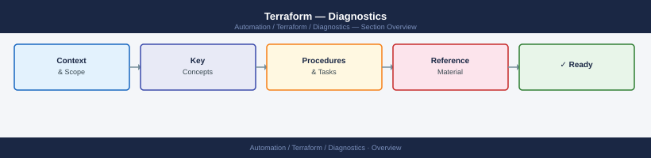
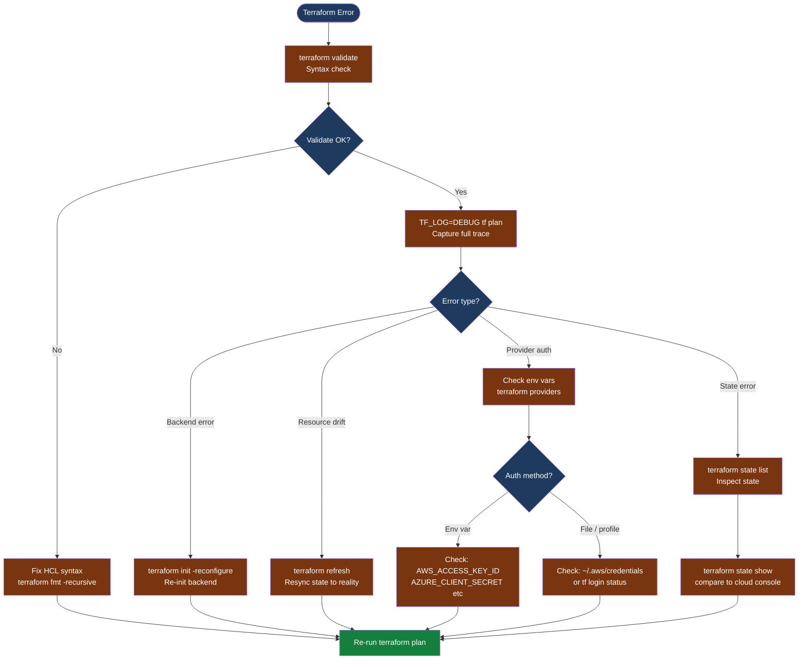

---
tags:
  - terraform
  - troubleshooting
search:
  boost: 1.5
---
# Terraform — Diagnostics

<div class="kb-summary">
Terraform diagnostic commands: enable TF_LOG trace logging, inspect plan output as JSON, audit state with terraform state commands, debug provider authentication, diagnose backend connectivity, and safely recover from state lock incidents.

*Applies to: Terraform 1.x / OpenTofu 1.x*
</div>





## Before you begin

- **Access:** Provider credentials configured (env vars, credential file, or `terraform login`); read access to the backend (S3 bucket, Azure container, Terraform Cloud workspace)
- **Gather first:** the exact error message from `terraform plan` or `terraform apply`, the provider name and version, and whether a state lock is present
- **Never edit `.tfstate` directly:** the JSON structure has checksums; manual edits corrupt state and may require full re-import
- **State backups:** `terraform state pull > backup-$(date +%F).tfstate` before any state manipulation command
- **force-unlock caution:** only use `terraform force-unlock` after confirming the process that set the lock is truly gone — removing an active lock allows concurrent applies, which corrupts state

---

## Step 1 — Validate and format

```bash
# Check configuration syntax without calling any provider APIs
terraform validate
# Expected: "Success! The configuration is valid."
# If error: the output includes file path and line number

# Check and fix formatting (catches common style issues that can cause parse errors)
terraform fmt -check -recursive
terraform fmt -recursive   # auto-fix formatting

# Verify provider versions in use
terraform version
# Shows: Terraform version + all provider plugins with versions

# List all providers declared and their source addresses
terraform providers
# Output: dependency tree of modules → providers
```

---

## Step 2 — Enable debug logging

```bash
# Enable trace-level logging (most verbose — includes all provider API calls)
export TF_LOG=TRACE
export TF_LOG_PATH=./terraform-debug-$(date +%F-%H%M).log
terraform plan 2>&1 | tee /tmp/tf-plan-output.txt

# Provider-only trace (reduces noise if only provider API calls are needed)
export TF_LOG_PROVIDER=DEBUG
export TF_LOG=INFO
terraform plan 2>&1 | tee /tmp/tf-plan-output.txt

# After diagnosis — unset to avoid trace log overhead
unset TF_LOG TF_LOG_PROVIDER TF_LOG_PATH

# Search the trace log for the root cause
grep -i "error\|fail\|denied\|unauthorized" terraform-debug-*.log | head -50

# Find provider API calls and their response codes
grep -E "HTTP.*[45][0-9][0-9]" terraform-debug-*.log | head -20
```

---

## Step 3 — Debug provider authentication

```bash
# List provider plugins installed in the working directory
terraform providers

# Check which credentials are configured in environment variables
# AWS:
env | grep -E "AWS_ACCESS_KEY|AWS_SECRET|AWS_SESSION_TOKEN|AWS_PROFILE|AWS_REGION"
aws sts get-caller-identity    # Verify the identity Terraform will use

# Azure:
env | grep -E "ARM_CLIENT|ARM_TENANT|ARM_SUBSCRIPTION|ARM_USE_MSI"
az account show                # Verify Azure identity

# GCP:
env | grep GOOGLE_CREDENTIALS
gcloud auth application-default print-access-token | head -c 50

# vSphere (govmomi-based providers):
env | grep -E "VSPHERE_USER|VSPHERE_PASSWORD|VSPHERE_SERVER"
govc about -u "https://${VSPHERE_USER}:${VSPHERE_PASSWORD}@${VSPHERE_SERVER}"

# For profile-based AWS auth (multiple accounts):
aws configure list
cat ~/.aws/credentials | grep -A3 "\[<profile-name>\]"
# To use a specific profile in Terraform:
export AWS_PROFILE=<profile-name>

# For Terraform Cloud authentication:
terraform login
# Verify: ~/.terraform.d/credentials.tfrc.json exists and contains token for app.terraform.io
```

---

## Step 4 — Inspect and audit state

```bash
# Safe state inspection commands (read-only, no changes)

# List all resources tracked in state
terraform state list
# Each line: resource_type.resource_name (e.g., aws_instance.web01)

# Show all attributes for a specific resource
terraform state show aws_instance.web01
# Compare these values to what the cloud console shows
# Discrepancies = drift; resolve with terraform refresh or targeted import

# Pull remote state as JSON for offline inspection
terraform state pull | jq '.' > /tmp/state-$(date +%F).json
# Count resources in state
terraform state pull | jq '.resources | length'
# Find a specific resource by attribute value
terraform state pull | jq '.resources[] | select(.type == "aws_s3_bucket") | {name, instances}'

# Check backend configuration
cat .terraform/terraform.tfstate          # local; shows which workspace is active
# For S3 backend: also check DynamoDB for an active lock entry
aws dynamodb scan --table-name <lock-table-name> --filter-expression "attribute_exists(LockID)"
```

---

## Step 5 — Diagnose backend connectivity

```bash
# Re-initialize the backend (safe — does not change state)
terraform init -reconfigure
# If this fails, the backend endpoint is unreachable or credentials lack access

# For S3 backend — test directly
aws s3 ls s3://<state-bucket>/<state-prefix>/
# Expected: lists state file(s); if AccessDenied = IAM permission issue

# For Azure blob backend
az storage blob list \
  --account-name <storage-account> \
  --container-name <container> \
  --prefix <workspace-key> \
  --auth-mode login

# For Terraform Cloud
curl -s -H "Authorization: Bearer $(cat ~/.terraform.d/credentials.tfrc.json | jq -r '.credentials."app.terraform.io".token')" \
  "https://app.terraform.io/api/v2/organizations" | jq '.data[].attributes.name'
# Expected: your organization name

# Diagnose state lock (S3 + DynamoDB backend)
# Check if a lock exists in DynamoDB
aws dynamodb get-item \
  --table-name <dynamodb-lock-table> \
  --key '{"LockID": {"S": "<s3-bucket>/<state-prefix>/terraform.tfstate-md5"}}' \
  --query 'Item'
# If output is non-empty, a lock is active; note the LockID for force-unlock
```

---

## Step 6 — State lock recovery (caution)

```bash
# SAFE: Back up state before any lock operation
terraform state pull > /tmp/state-backup-$(date +%F-%H%M).tfstate

# Check the lock info (Terraform includes lock ID in the error message)
# Error looks like: "Error: Error locking state: Error acquiring the state lock"
# Note the Lock ID from the error message

# Verify the locking process is truly gone before unlocking
# For CI/CD runners: check if the pipeline run that acquired the lock has terminated
# For local workstations: check if another terminal session is running terraform

# Unlock only when you are certain no other process holds the lock
terraform force-unlock <lock-id>
# This is irreversible; if a legitimate apply was in progress, it will continue writing to
# a state that is now also unlocked — resulting in corrupted state

# After force-unlock: immediately run plan to verify state consistency
terraform plan
```

---

## Plan inspection

```bash
# Save a plan in binary format, then inspect
terraform plan -out=tfplan
terraform show tfplan                 # Human-readable

# Machine-readable JSON plan
terraform show -json tfplan | jq '.' > /tmp/plan.json

# Find all resources that will change
terraform show -json tfplan | jq '.resource_changes[] | select(.change.actions[] != "no-op") | {address, actions: .change.actions}'

# Find resources that will be destroyed
terraform show -json tfplan | jq '.resource_changes[] | select(.change.actions[] == "delete") | .address'

# Visualise resource dependency graph
terraform graph | dot -Tsvg > /tmp/tf-graph.svg
# Open in a browser or SVG viewer to trace dependency cycles
```

---

## See also

- [Terraform — Common Issues](../common-issues/)
- [Terraform — Escalation](../escalation/)
- [Terraform — Health Checks](../../operations/health-checks/)

## Verify resolution

- `terraform validate` returns `"The configuration is valid."`
- `terraform plan` shows the expected set of changes (or `No changes.`) with no errors
- `terraform state list` matches the expected set of managed resources
- For backend issues: `terraform init` completes without error and state is accessible
- After any state manipulation: run `terraform plan` and confirm no unexpected changes appear
