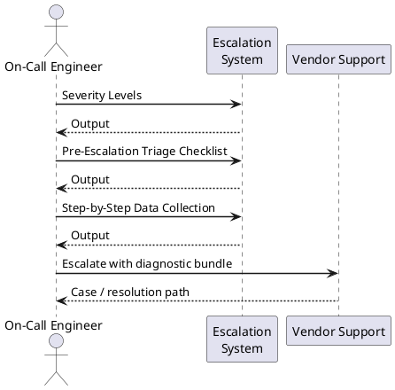

---
tags:
  - terraform
  - troubleshooting
search:
  boost: 1.5
description: "Terraform escalation: when to open a HashiCorp support case, how to file a provider bug on GitHub, how to collect state and log diagnostics, and the..."
---
# Terraform — Escalation

<div class="kb-summary">
Terraform escalation: when to open a HashiCorp support case, how to file a provider bug on GitHub, how to collect state and log diagnostics, and the escalation path for state corruption, provider panics, and Terraform Cloud outages.

*Applies to: Terraform 1.x / Terraform Cloud / HCP Terraform*
</div>



## Before you begin

- **Access:** Backend credentials (S3, Azure Blob, GCS) to read and optionally restore the state file; provider credentials
- **Gather first:** exact error message, `terraform version` output, provider name and version, and current workspace name
- **State backup:** before any recovery action, always take a manual backup of the state file first (`terraform state pull > backup-$(date +%F).tfstate`)
- **Scope:** confirm whether the issue is a provider API error (external), a Terraform core bug, or a state consistency problem
- **Do not retry blind:** do not run `terraform apply` again if the previous apply left infrastructure in an unknown partial state — assess with `terraform plan` first

---

## Severity Levels

| Severity | Definition | Support Channel |
|---|---|---|
| S1 — Critical | TF Cloud/Enterprise platform down; state corruption with data loss risk; production infrastructure stuck | HashiCorp support: support.hashicorp.com + phone (Enterprise SLA) |
| S2 — High | Provider panic crashing all applies; state locked preventing all changes; Sentinel blocking critical deploys | HashiCorp support: support.hashicorp.com |
| S3 — Medium | Single resource in wrong state; provider returning intermittent errors; plan output incorrect | GitHub issue on relevant provider repo |
| S4 — Low | Feature request; configuration question; performance tuning | Community: discuss.hashicorp.com |

## Pre-Escalation Triage Checklist

| Check | Command | Expected |
|---|---|---|
| Terraform core version | `terraform version` | Expected version; no update notice for critical path |
| Provider version pinned | Check `.terraform.lock.hcl` | Provider hash present; version constraint satisfied |
| Backend accessible | `terraform init` with `-reconfigure` | No backend authentication error |
| State lock status | `terraform state list` or check backend lock table | No lock; or lock with identifiable owner |
| Plan can be generated | `terraform plan -input=false` | Plan output (even with errors) — not a panic |
| Provider credentials valid | `terraform providers` then test API call | No `auth` or `403` errors |
| State consistent with reality | `terraform plan` shows expected drift | No unexpected destroy actions or phantom resources |

---

## Step-by-Step Data Collection

### 1. Collect version and provider info

```bash
# Core version and all providers
terraform version 2>&1 | tee /tmp/tf-versions.txt

# Provider constraints and locked versions
cat .terraform.lock.hcl
cat versions.tf

# Current workspace
terraform workspace show

# All providers with their sources
terraform providers 2>&1
```


```text title="Expected output"
Terraform v1.6.4
on linux_amd64

Your version of Terraform is out of date! The newest version
is 1.7.2. You can update by downloading from https://www.terraform.io/downloads.html

Terraform has been successfully initialized!

Associated Terraform configuration files:

.terraform/modules/vpc
.terraform/modules/security_groups

# lock file for terraform >= 1.2
provider "registry.terraform.io/hashicorp/aws" {
  version     = "5.31.0"
  constraints = ">= 5.0"
  hashes = [
    "h1:LlUeeWvzHBIKS1UeTVzUTc1/ZYkiXRHV5qKbqSQIAE=",
  ]
}

provider "registry.terraform.io/hashicorp/kubernetes" {
  version     = "2.24.1"
  constraints = "~> 2.24"
  hashes = [
    "h1:7VRKyqKxYrXR6lGKbB8UKPqKvJxKxKxKvJxKxKvJxK=",
  ]
}

terraform {
  required_version = ">= 1.5"
  required_providers {
    aws = {
      source  = "hashicorp/aws"
      version = "~> 5.31"
    }
    kubernetes = {
      source  = "hashicorp/kubernetes"
      version = "~> 2.24"
    }
  }
}

default

Providers required by configuration:

.
├── provider[registry.terraform.io/hashicorp/aws] 5.31.0
└── provider[registry.terraform.io/hashicorp/kubernetes] 2.24.1

Providers required by state:

.
├── provider[registry.terraform.io/hashicorp/aws] 5.31.0
└── provider[registry.terraform.io/hashicorp/kubernetes] 2.24.1
```

!!! warning "Common errors"
    | Error | Fix |
    |---|---|
    | `Error: Failed to query available provider packages` | Run `terraform init` to download and cache the required providers before running diagnostics. |
    | `Error reading .terraform.lock.hcl: no such file or directory` | Execute `terraform init` in the working directory to generate the lock file and download providers. |
### 2. Collect debug-level logs

```bash
# Set trace logging — WARNING: this logs provider credentials in environment variable names
export TF_LOG=TRACE
export TF_LOG_PATH=/tmp/terraform-trace-$(date +%F-%H%M%S).log

# Re-run the failing command (plan or apply)
terraform plan -input=false 2>&1 | tee /tmp/terraform-plan.log

# Unset after collection
unset TF_LOG TF_LOG_PATH
```


```text title="Expected output"
2024-01-15T09:47:32.123Z [INFO] Terraform version: 1.5.7
2024-01-15T09:47:32.456Z [DEBUG] initiate new HTTP client
2024-01-15T09:47:33.012Z [TRACE] provider.terraform-provider-aws: Calling provider defined Configure Type...
2024-01-15T09:47:33.234Z [TRACE] EvalApply: aws_instance.web_server
2024-01-15T09:47:33.567Z [DEBUG] No changes. Infrastructure is up to date.

Plan: 0 to add, 0 to change, 0 to destroy.
2024-01-15T09:47:34.890Z [TRACE] Context shutdown complete
```

!!! warning "Common errors"
    | Error | Fix |
    |---|---|
    | `Error: open /tmp/terraform-trace-*.log: permission denied` | Verify `/tmp` is writable with `ls -ld /tmp` and check your user permissions. |
    | `Error: TF_LOG set to invalid log level "TRACE"` | Use only valid levels: TRACE, DEBUG, INFO, WARN, ERROR; verify the export statement spelling. |
### 3. Collect state file safely

```bash
# Pull current state (always back up before recovery)
terraform state pull > /tmp/state-backup-$(date +%F-%H%M%S).tfstate

# Sanitise sensitive values before sharing with HashiCorp support
# DO NOT share raw state if it contains passwords, private keys, or tokens
# Instead, share the resource type/name structure:
terraform state list > /tmp/state-resource-list.txt
terraform show -json | python3 -c "
import sys, json
state = json.load(sys.stdin)
# Print only resource types and names, not attribute values
for res in state.get('values',{}).get('root_module',{}).get('resources',[]):
    print(f'{res[\"type\"]}.{res[\"name\"]}')
" > /tmp/state-structure.txt
```


```text title="Expected output"
state-backup-2024-01-15-143022.tfstate
aws_instance.web_server
aws_instance.db_replica
aws_rds_cluster.primary
aws_security_group.app_tier
aws_vpc.main
aws_subnet.private_a
aws_subnet.private_b
aws_iam_role.lambda_exec
aws_lambda_function.processor
aws_s3_bucket.artifacts
```

!!! warning "Common errors"
    | Error | Fix |
    |---|---|
    | `jq: command not found` | Install `jq` or use the Python JSON parser as shown; if using Python, ensure `python3` is in PATH. |
    | `Error reading state file: stat /tmp/state-backup-*.tfstate: no such file or directory` | Verify `/tmp` directory exists and has write permissions; check disk space with `df -h /tmp`. |
    | `json.decoder.JSONDecodeError: Expecting value: line 1 column 1` | Ensure `terraform show -json` runs successfully before piping to Python; run `terraform show -json` standalone to verify state is valid. |
### 4. Collect plan output in JSON format

```bash
# Save plan to a file
terraform plan -out=/tmp/tfplan -input=false 2>&1 | tee /tmp/plan-output.log

# Export plan in JSON format (contains full resource change details)
terraform show -json /tmp/tfplan > /tmp/tfplan.json

# Summarise: count of resources to add/change/destroy
python3 -c "
import json
with open('/tmp/tfplan.json') as f:
    plan = json.load(f)
changes = plan.get('resource_changes', [])
from collections import Counter
counts = Counter(c['change']['actions'][0] for c in changes if c.get('change',{}).get('actions'))
print(dict(counts))
"
```


```text title="Expected output"
Terraform used the remote state from s3://terraform-state-prod/main.tfstate

Terraform will perform the following actions:

  # aws_instance.web[0] will be created
  + resource "aws_instance" "web" {
      + ami           = "ami-0c55b159cbfafe1f0"
      + instance_type = "t3.medium"
      + tags          = {
          + "Name" = "web-server-01"
        }
    }

  # aws_security_group.app will be updated in-place
  ~ resource "aws_security_group" "app" {
      ~ ingress {
          + cidr_blocks = ["10.0.0.0/8"]
        }
    }

  # aws_rds_instance.db will be destroyed
  - resource "aws_rds_instance" "db" {
      - allocated_storage = 100
      - engine            = "postgres"
    }

Plan: 1 to add, 1 to change, 1 to destroy.

Saved the plan to: /tmp/tfplan
{'create': 1, 'update': 1, 'delete': 1}
```

!!! warning "Common errors"
    | Error | Fix |
    |---|---|
    | `Error reading plan file: stat /tmp/tfplan: no such file or directory` | Ensure `terraform plan -out=/tmp/tfplan` completes successfully before running `terraform show`; check disk space and write permissions on /tmp. |
    | `json.decoder.JSONDecodeError: Expecting value: line 1 column 1 (char 0)` | Verify the plan file is valid by running `terraform show -json /tmp/tfplan` manually; the plan may be corrupted or the file path incorrect. |
### 5. Write the timeline

```text
Terraform version: 1.9.3
Provider: hashicorp/aws v5.60.0 (or: hashicorp/vsphere v2.8.3)
Backend: S3 (bucket: tf-state-prod, key: production/terraform.tfstate, region: eu-west-1)
Workspace: production

Issue first observed: 2026-06-15 14:00 UTC
Last successful apply: 2026-06-15 11:30 UTC

Error observed (exact):
  Error: Provider produced inconsistent final plan
  → on main.tf line 45, in resource "aws_instance" "web":
  → 45: ami = var.ami_id
  → Provider produced inconsistent result after apply.

State status:
  Lock: None (or "Lock held by run-123456 since 14:05 UTC")
  Partial apply: Yes (3 of 7 resources created before failure)

Changes in 2h before issue:
  - Provider upgraded from aws v5.58.0 to v5.60.0 via automated lock update
  - No configuration changes

Blast radius:
  - 3 EC2 instances created but not fully configured (no security groups attached)
  - remaining 4 resources not created
  - No production traffic impact yet
```

---

## How to Open a HashiCorp Support Case

**For Terraform Cloud or Enterprise issues** (paid support):

1. Go to **support.hashicorp.com** and sign in with your HashiCorp Cloud Platform or Enterprise account.

2. Click **Submit a ticket**.

3. Under **Product**, select **Terraform Cloud**, **Terraform Enterprise**, or **HCP Terraform**.

4. Under **Severity**, select:
   - **1 — Critical**: TF Cloud/Enterprise completely unavailable; state corruption; production infrastructure frozen
   - **2 — High**: Major feature blocked (all applies failing); Sentinel blocking critical pipeline
   - **3 — Medium**: Single workspace broken; non-critical feature unavailable
   - **4 — Low**: Feature request; usage question

5. In the **Subject**: `TF Cloud — All applies failing with provider panic after aws provider upgrade to 5.60.0`.

6. In the **Description**, paste:
   - Terraform and provider versions
   - Backend type and workspace name
   - Timeline (from step 5)
   - Exact error message
   - Whether state is locked and with what run ID
   - Partial apply status

7. Upload attachments:
   - `tf-versions.txt`
   - `plan-output.log`
   - `terraform-trace-<date>.log` (sanitised — remove credential values)
   - `state-structure.txt` (resource names only, not values)

8. Click **Submit**. Case number arrives by email.

**For provider bugs** (open-source, no SLA):

1. Go to **github.com/hashicorp/terraform-provider-\<name\>/issues** and search first.
2. Click **New issue** → select **Bug report**.
3. Fill in the template: TF version, provider version, minimal reproduction config, expected vs actual behaviour.
4. Attach `terraform-trace-<date>.log` (remove credentials from the log before uploading).

---

## Escalation Path

```text
Step 1 — Identify the failure layer: Terraform Core, provider, backend, or TF Cloud platform
         ↓
Step 2 — Provider bug: file GitHub issue on github.com/hashicorp/terraform-provider-<name>
         Include: minimal reproduction config, TF version, provider version, trace log
         ↓
Step 3 — State corruption: open HashiCorp support case at support.hashicorp.com
         Attach sanitised state structure, plan log, and timeline
         → Do NOT attempt manual state edit — wait for HashiCorp guidance
         ↓
Step 4 — TF Cloud/Enterprise platform issue: open support case + check status.hashicorp.com
         For Enterprise: call the emergency contact number in your contract for S1
         ↓
Step 5 — If no progress in 4 hours for S1 / 1 business day for S2:
         → Add a case update: "Requesting escalation — [n] production environments frozen since [time]"
         ↓
Step 6 — For state corruption with data loss risk:
         → Restore from backend version history immediately (S3 versioning, GCS object versioning)
         → Document the restore in the SR before executing
```

---

## What NOT to Do

| Do NOT do this | Why | What to do instead |
|---|---|---|
| Edit the state file manually in a text editor | JSON is complex; a single mistake corrupts the entire state and Terraform cannot recover | Use `terraform state mv`, `terraform state rm`, or `terraform import` for state manipulation |
| Run `terraform force-unlock` without confirming the lock is stale | If the lock is held by an active run, force-unlock causes concurrent state writes | Confirm the locking run is dead (TF Cloud: check runs page; S3: check DynamoDB lock table) |
| Run `terraform destroy -target` on partially applied resources to clean up | Destroy operations use the current (possibly corrupt) state — may destroy wrong resources | Take a manual backup first; use `terraform state rm` to disassociate only |
| Downgrade the provider version directly in `.terraform.lock.hcl` | Lock file hashes are cryptographic — manual edits will cause `init` to fail with hash mismatch | Use `terraform init -upgrade` with an explicit version constraint in `versions.tf` |
| Share the raw state file with external support | State files contain plaintext provider credentials, tokens, and private keys | Extract resource structure only (`terraform state list`); never attach the raw `.tfstate` file |

---

## State Recovery Reference

| Situation | Safe first step |
|---|---|
| State locked with no active run | `terraform force-unlock <lock-id>` — confirm run is dead first |
| Partial apply (some resources created) | `terraform plan` to assess actual drift; `terraform apply` to reconcile |
| State file corrupt | Restore from backend version history (S3 versioning); never edit state manually |
| Resource in wrong state | `terraform state rm <resource>` then `terraform import <resource> <id>` |
| Provider version regression | Restore previous `.terraform.lock.hcl`; run `terraform init` |
| Wrong workspace applied | `terraform workspace select <correct-workspace>` then `terraform plan` to verify |

---

## Useful Commands for Case Updates

```bash
# Snapshot current state for every case update
terraform version 2>&1
terraform workspace show
terraform state list 2>&1 | wc -l   # total resource count

# Check if lock is current (S3 + DynamoDB backend)
aws dynamodb get-item \
  --table-name <lock-table-name> \
  --key '{"LockID":{"S":"<bucket>/<key>"}}' \
  --region <region>

# Show what changed in the last successful apply (git diff on config)
git log --oneline -5
git diff HEAD~1 HEAD -- '*.tf'

# Verify backend accessibility
terraform init -backend-only -reconfigure 2>&1 | tail -5

# List workspace states to confirm which workspace is affected
terraform workspace list
```


```text title="Expected output"
Terraform v1.5.7
on linux_amd64

default
42

{
    "Item": {
        "LockID": {
            "S": "terraform-prod-bucket/prod/terraform.tfstate"
        },
        "Digest": {
            "S": "a7f3e2c9b1d4f6e8a2c5d7f9e1b3a5c7"
        },
        "Operation": {
            "S": "OperationTypeApply"
        },
        "Info": {
            "S": "user@host"
        },
        "Who": {
            "S": "terraform"
        },
        "Version": {
            "N": "1"
        },
        "Created": {
            "N": "1698765432"
        }
    }
}

a3f2e1c 'Add RDS subnet group for multi-AZ failover'
b5d4c3a 'Update security group ingress rules'
c7f6e5d 'Provision ALB target group'
d9h8g7f 'Initial VPC and subnet configuration'
e1j0i9h 'Add CloudWatch monitoring dashboards'

resource "aws_security_group" "alb" {
  ingress {
-   from_port = 80
+   from_port = 443
    to_port   = 443
  }
}

Initializing the backend...

Successfully configured the backend "s3" [bucket="terraform-prod-bucket"]
Initializing provider plugins...
- Reusing previous version of hashicorp/aws from the dependency lock file
- Using previously-installed hashicorp/aws v5.12.0

  default
* prod
  staging
```

!!! warning "Common errors"
    | Error | Fix |
    |---|---|
    | `Error: Error acquiring the state lock` | Run `terraform force-unlock <LOCK_ID>` after verifying no other apply operations are running, then retry the command. |
    | `Error: error reading S3 Bucket in region <region>: AccessDenied: Access Denied` | Verify IAM permissions include `s3:GetObject` and `s3:ListBucket` on the state bucket, and check the AWS credentials being used. |
    | `fatal: your current branch 'main' does not have any commits yet` | Initialize the git repository with at least one commit before running git log commands. |
---

## See also

- [Terraform — Diagnostics](../diagnostics/)
- [Terraform — Common Issues](../common-issues/)

---

## Verify resolution

- Confirm `terraform plan` produces the expected diff with no panics or unexpected destroy actions
- Run `terraform apply` on a non-production environment first to confirm the fix is stable
- Verify the state file is consistent: `terraform show` should reflect actual infrastructure state
- Check the backend lock table — no stale lock entries remaining
- Monitor the next scheduled pipeline run to confirm automation is working end-to-end
