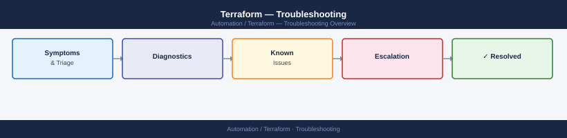

---
tags:
  - terraform
  - troubleshooting
search:
  boost: 1.5
---
# Terraform — Troubleshooting

Diagnosing state drift, provider errors, plan failures, lock conflicts, and common Terraform workflow issues.

*Applies to: Terraform 1.x*

<a class="kb-card" href="common-issues/">
  <strong>Common Issues</strong>
  Provider errors, state conflicts, and workspace problems.
</a>

<a class="kb-card" href="diagnostics/">
  <strong>Diagnostics</strong>
  Debug logging, plan inspection, and validation tools.
</a>

<a class="kb-card" href="escalation/">
  <strong>Escalation</strong>
  When and how to escalate unresolved issues.
</a>

