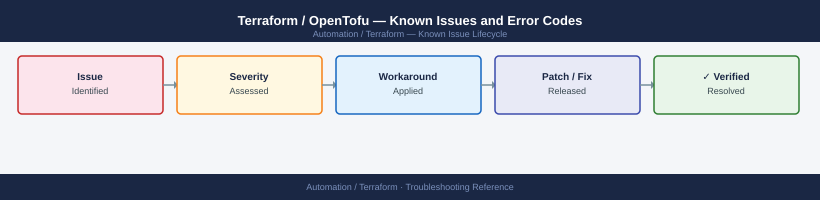

---
tags:
  - troubleshooting
  - terraform
  - automation
  - known-issues
description: "Catalog of known Terraform and Terraform Enterprise bugs, error codes, and workarounds covering state management, provider errors, and locking."
---
# Terraform / OpenTofu — Known Issues and Error Codes

<div class="kb-summary">
Catalog of known Terraform and Terraform Enterprise bugs, error codes, and workarounds covering state management, provider errors, and locking.

*Applies to: Terraform 1.5.x / 1.9.x, TFE (Terraform Enterprise)*
</div>



```d2
direction: down

symptom: Identify Symptom {shape: diamond}
state_and_locking: "State and Locking" {shape: rectangle}
provider_errors: "Provider Errors" {shape: rectangle}
tfe_enterprise: "TFE (Enterprise)" {shape: rectangle}
resolution: Resolve or Escalate {shape: oval}

symptom -> state_and_locking: investigate
symptom -> provider_errors: investigate
symptom -> tfe_enterprise: investigate
state_and_locking -> resolution
provider_errors -> resolution
tfe_enterprise -> resolution
```

## Before you begin

- Terraform errors appear in `terraform plan` / `terraform apply` output.
- TFE run errors appear in TFE UI → Workspace → Runs.
- State issues are the most dangerous — always backup state before manual state manipulation.

## State and Locking

| Error / Symptom | Affected Versions | Cause | Workaround / Fix | Fixed In |
|---|---|---|---|---|
| `Error acquiring the state lock` | All | Previous run crashed without releasing lock | Force unlock: `terraform force-unlock <lock-id>` (confirm no other operation running) | N/A |
| `State file outdated — refresh required` | All | State file diverged from actual infrastructure | Run `terraform refresh` to re-sync state with reality | N/A |
| `Error loading state` — backend unreachable | All | S3 bucket or TFE not reachable | Verify backend connectivity (TCP 443 to S3/TFE); check credentials | N/A |

## Provider Errors

| Error / Symptom | Affected Versions | Cause | Workaround / Fix | Fixed In |
|---|---|---|---|---|
| `Provider produced inconsistent result after apply` | All | Provider bug or timing issue (resource not ready) | Add `depends_on` or `time_sleep`; check provider GitHub issues | Depends on provider |
| `Error: 429 Too Many Requests` from cloud provider | All | Terraform parallelism too high for provider rate limits | Reduce parallelism: `terraform apply -parallelism=5` | N/A |
| `Error configuring Terraform AWS Provider: no valid credential sources found` | All | AWS credentials not available in execution environment | Set `AWS_ACCESS_KEY_ID`/`AWS_SECRET_ACCESS_KEY` or use IAM role | N/A |

## TFE (Enterprise)

| Error / Symptom | Affected Versions | Cause | Workaround / Fix | Fixed In |
|---|---|---|---|---|
| TFE agent not connecting | TFE | TCP 443 from agent to TFE blocked | Verify TCP 443 from agent host to TFE; check agent token is valid | N/A |
| Run stuck in `Planning` | TFE | Agent not available in agent pool | Check TFE → Settings → Agent Pools; ensure agent is online | N/A |

## See also

- [Terraform — Common Issues](../common-issues/)
- [Ansible — Known Issues](../../ansible/troubleshooting/known-issues.md)
- [GitHub Actions — Known Issues](../../github-actions/troubleshooting/known-issues.md)
