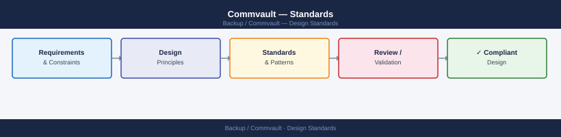

---
tags:
  - architecture
  - commvault
---
# Commvault — Standards


<div class="kb-summary">
Standards reference covering Naming Conventions, Retention Schedule, VMware vSphere Standards, Encryption Standard.

*Applies to: Commvault 11.x*
</div>



```d2
direction: down

naming_conventions: "Naming Conventions" {shape: rectangle}
retention_schedule: "Retention Schedule" {shape: rectangle}
vmware_vsphere_standards: "VMware vSphere Standards" {shape: rectangle}
encryption_standard: "Encryption Standard" {shape: rectangle}

naming_conventions -> retention_schedule: hardens
retention_schedule -> vmware_vsphere_standards: hardens
vmware_vsphere_standards -> encryption_standard: hardens
```

## Naming Conventions

| Object | Convention | Example |
|---|---|---|
| Storage Policy | `<app>-<retention>-<tier>` | `oracle-7yr-primary`, `vm-90d-secondary` |
| Subclient | `<app>-<env>-<host>-<type>` | `oracle-prod-db01-full` |
| Client Group | `<env>-<os>-<tier>` | `prod-linux-db`, `dev-windows-app` |
| Schedule Policy | `<frequency>-<retention>` | `daily-14d`, `weekly-8w` |
| MediaAgent | `<site>-ma-<seq>` | `dc1-ma-01`, `dc2-ma-01` |

## Retention Schedule

| Level | Copy | Retention |
|---|---|---|
| Daily | Primary (disk/dedup) | 14 days |
| Weekly | Primary (disk/dedup) | 8 weeks |
| Monthly | Secondary (offsite or cloud) | 12 months |
| Yearly | Secondary (tape or cloud archive) | 7 years |

Configure via SLA Plans in Command Center (preferred for FR32+) or directly in Storage Policy (legacy).

### Capacity Planning Flow


## VMware vSphere Standards

| Setting | Value |
|---|---|
| Backup proxy type | Hot-add (SAN or VDDK) preferred over NBD |
| Number of proxies | Minimum 2 per site for redundancy |
| VMware concurrent tasks per proxy | Maximum 4 (adjust per MediaAgent CPU) |
| VSA subclient granularity | Per-datastore or per-folder; never entire vCenter in one subclient |
| Application-aware backup | Enabled for SQL Server, Oracle, Exchange VMs |

## Encryption Standard

| Data Classification | Encryption Required | Algorithm |
|---|---|---|
| PII / Regulated | Yes — mandatory | AES-256, MediaAgent-side minimum |
| Business-sensitive | Yes — recommended | AES-256 |
| Internal non-sensitive | Optional | Per policy decision |

- Encryption keys: exported and stored in CyberArk or offline secure vault
- Loss of key = loss of backup data — key management is as critical as backup data itself

---

## See also

- [Commvault — Deploy](../../deploy/)
