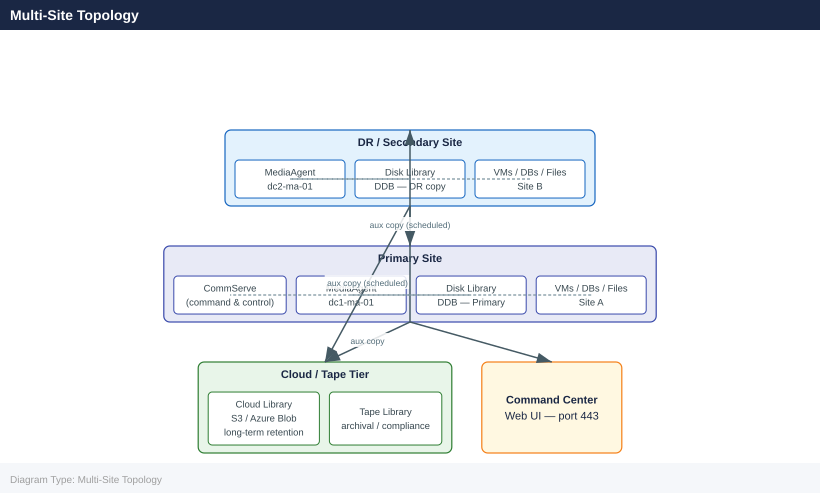

---
tags:
  - architecture
  - commvault
---
# Commvault — How It Works

<div class="kb-summary">
How It Works reference covering Overview, Component Topology, MediaAgent and Deduplication, Storage Library Types, Port Requirements and 1 more sections.

*Applies to: Commvault 11.x*
</div>

## Overview

Commvault provides enterprise backup, recovery, replication, archive, and data protection management. The CommServe is the single command-and-control server — it holds the configuration database (SQL Server) mapping every backup job, client, and storage policy. MediaAgents perform data movement and host the Deduplication Database (DDB). Clients are the protected hosts (VMs, databases, filesystems).

## Component Topology

```d2
direction: right

MA1: "Media Agent 1\n(data mover" {shape: rectangle}
MA2: "Media Agent 2" {shape: rectangle}
CS: "CS" {shape: rectangle}
SRC: "Source — VMs / DBs / Files" {shape: rectangle}
DISK: "Disk Library\nDDB dedup" {shape: rectangle}
TAPE: "Tape / Object\nlong-term retention" {shape: rectangle}
ADMIN: "Backup Admin" {shape: rectangle}
WEBCON: "WEBCON" {shape: rectangle}

MA1 -> MA2
MA2 -> CS
SRC -> MA1
MA2 -> DISK
DISK -> TAPE
ADMIN -> WEBCON
```

MediaAgent best practices:
- Deploy one MediaAgent per site for local backups
- Place DDB on SSD-backed storage — IOPS are critical for large dedup pools
- DDB free space: maintain ≥ 20% free at all times
- Single DDB should not manage more than 60 TB of deduped data

## Storage Library Types

| Type | Use Case | Notes |
|---|---|---|
| Disk Library (Dedup) | Primary backup target | SSD recommended for DDB |
| Cloud Library (S3) | Long-term retention | AWS S3, Azure Blob, GCP |
| Tape Library | Offsite/archival | Via SAN-attached or NDMP |
| Hyperscale X | Integrated scale-out | CommVault managed hardware; minimum 3-node cluster |

## Port Requirements

| Source | Destination | Port | Purpose |
|---|---|---|---|
| Clients | CommServe | 8400 | Job requests |
| Clients | MediaAgent | 8403 | Data movement |
| CommServe | MediaAgent | 8400 | Job orchestration |
| Browser (admin) | Command Center | 443 | Web UI |

## Multi-Site Topology



---

## See also

- [Commvault — Design Standards](../design-standards/)
- [Commvault — Integrations](../integrations/)
- [Commvault — Deploy](../../deploy/)
