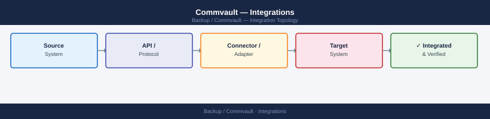

---
tags:
  - architecture
  - commvault
---
# Commvault — Integrations


<div class="kb-summary">
Commvault integration with VMware vSphere, storage arrays, LDAP, SMTP, and third-party monitoring platforms.

*Applies to: Commvault 11.x*
</div>



Commvault integrates with virtualisation, storage, cloud, and identity platforms through a combination of native agents and vendor-certified plugins. VMware integration uses the Virtual Server Agent (VSA) deployed on a proxy with vCenter credentials, leveraging VADP for snapshot-based VM backups. IntelliSnap integrates with certified storage arrays to orchestrate hardware snapshots as backup sources, dramatically reducing backup windows and production impact.

| Integration | Method | Notes |
|---|---|---|
| VMware vSphere | VSA proxy, VADP, vCenter API | CBT for incrementals; vCenter credentials in CommVault |
| Dell PowerMax | IntelliSnap plugin | Hardware snapshot-based backup; SRDF-aware |
| Dell Data Domain | DD Boost MediaAgent plugin | Inline dedup; AIR replication to secondary DD |
| Dell Unity | IntelliSnap plugin | NAS and block snapshot integration |
| Pure FlashArray | IntelliSnap plugin | REST API-driven snapshot orchestration |
| AWS S3 | Cloud library (MediaAgent) | Long-term retention; lifecycle rules for tiering |
| Azure Blob | Cloud library (MediaAgent) | Azure AD service principal auth |
| LDAP / Active Directory | CommServe auth config | AD groups mapped to CommVault user groups |
| SIEM (Splunk, etc.) | Audit log export / syslog | CommServe audit trail forwarded via syslog |

---

```d2
direction: right

center: "Commvault" {shape: hexagon}
component_a: "Component A" {shape: rectangle}
component_b: "Component B" {shape: rectangle}
component_c: "Component C" {shape: rectangle}

center -> component_a
center -> component_b
center -> component_c
```

## See also

- [Commvault — Design Standards](../design-standards/)
