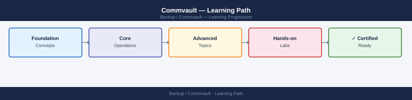

---
tags:
  - commvault
  - learning-path
---
# Commvault — Learning Path

Recommended reading order for Commvault data protection. Follow these stages in order to build a complete mental model before working with it in production.

*Applies to: Commvault 11.x*

## Stage 1 — Architecture

**Goal**: Understand the CommCell architecture — CommServe, MediaAgents, clients, storage policies, and subclient policies — and how data flows from source to primary to secondary storage.

**Read in this order**:

- [How It Works](../architecture/how-it-works/) — CommCell hierarchy: CommServe as the control plane, MediaAgents as data movers, iDataAgents (clients) on protected systems; storage policy defines data path from primary (disk) to secondary (tape/cloud); subclient policies define what is backed up and at what frequency
- [Design Standards](../architecture/design-standards/) — MediaAgent sizing (streams, network bandwidth, library connections), storage policy copy design (primary, synchronous secondary, selective copy for archive), dedup (SIDB) engine placement, auxiliary copy scheduling for DR compliance
- [Integrations](../architecture/integrations/) — VMware vCenter integration (VADP), Oracle RMAN, SAP HANA, SQL Server VSS, NetApp SnapProtect for storage snapshot integration, cloud libraries (Azure Blob, S3, Google Cloud), Metallic SaaS option for cloud-managed CommServe

**Why first**: Commvault's storage policy and subclient model is its most distinctive design concept — operators who skip this stage frequently create misconfigured policies that silently miss data.

---

## Stage 2 — Deployment

**Goal**: Install CommServe, deploy MediaAgents and clients, configure libraries and storage policies, and run the first backup.

**Read**:

- [Deploy](../deploy/) — CommServe installation, MediaAgent installation and library configuration (disk library, tape library, cloud library), iDataAgent deployment to clients, storage policy and schedule policy creation, first backup job validation
- [Install & Upgrade](../operations/install-upgrade/) — CommCell upgrade sequence (CommServe first, then MediaAgents, then clients), maintenance release application, feature release upgrade planning

---

## Stage 3 — Operations

**Goal**: Monitor backup jobs, manage storage policy copies, run auxiliary copies, and execute restores.

**Read in this order**:

- [Health Checks](../operations/health-checks/) — Run the routine first on every shift; check CommCell dashboard for failed jobs, auxiliary copy lag, library health, dedup database status, MediaAgent connectivity
- [CLI Reference](../operations/cli-reference/) — `qoperation`, `qlist`, `qmodify` CLI reference; Commvault REST API for job queries and restore operations; Commvault Command Center web interface navigation
- [Procedures](../operations/procedures/) — Run an auxiliary copy, restore a VM (full and granular), restore a database to alternate location, configure a cloud storage library, modify a subclient backup content selection
- [Backup & Restore](../operations/backup-restore/) — Full VM restore, file-level restore, database restore to production and alternate, cross-MediaAgent restore, cloud tier restore (recall from archive copy)
- [Scripts](../operations/scripts/) — Job failure alerting via REST API, auxiliary copy completion monitoring, storage usage reporting per client, dedup savings reporting

---

## Stage 4 — Security

**Goal**: Enforce CommCell RBAC, protect the CommServe, and ensure backup data integrity.

**Read**:

- [Access Control](../security/access-control/) — Commvault user roles and capabilities: Master Admin, Tenant Admin, Operator, View; CommCell security associations; subclient-level access restriction for self-service restore
- [Authentication](../security/authentication/) — Active Directory integration for CommCell login, service account management for iDataAgents, MFA for CommServe administrative access
- [Encryption](../security/encryption/) — Commvault data encryption (AES-256) for backup data on disk and tape, network encryption between CommServe and MediaAgents, encryption key management (per-client keys)
- [Hardening](../security/hardening/) — Commvault Ransomware Protection (immutable copy on HyperScale/cloud), restrict CommServe management network, audit log export to SIEM, disable default admin account

---

## Stage 5 — Troubleshooting

**Goal**: Diagnose failed backup jobs, auxiliary copy failures, library errors, and restore issues.

**Read**:

- [Common Issues](../troubleshooting/common-issues/) — Backup job failing with network error to MediaAgent, auxiliary copy not completing (library unavailable, SIDB issue), VM restore failing (proxy error, datastore space), dedup database corruption warning
- [Diagnostics](../troubleshooting/diagnostics/) — CommCell Event Viewer, job detail logs (`/var/log/commvault`), MediaAgent log files, library diagnostic tests, `qscript -f` for CommServe database queries
- [Escalation](../troubleshooting/escalation/) — Commvault support case process, CommCell support bundle export (GxSupportBundle), Metallic support for SaaS-managed CommServe issues

**Why last**: Commvault failures almost always trace back to storage policy copy misconfiguration or MediaAgent connectivity — context established by understanding the CommCell architecture in Stage 1.

---

## See also

- [Commvault — Deploy](../deploy/)
- [Commvault — Procedures](../operations/procedures/)
- [Commvault — Common Issues](../troubleshooting/common-issues/)
