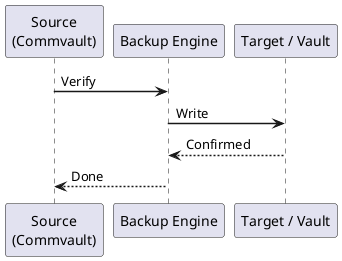

---
tags:
  - commvault
  - operations
---
# Commvault Backup and Restore — Procedures

```bash
curl -s -X POST "https://commserve.example.com/webconsole/api/Login" \
  -H "Content-Type: application/json" \
  -d '{"username":"admin","password":"<password>"}' | jq '.token'
```

```text
Subclient → Restore → In-Place → Overwrite existing data: Yes
```
```text
Subclient → Restore → Out-of-Place → Specify destination client and path
```
```bash
qoperation execscript -sn QS_ValidateCopy -si "StoragePolicyName" -si "CopyName"
```
```d2
direction: right

B: "B" {shape: rectangle}
C: "Entire VM" {shape: rectangle}
D: "Specific files/folders" {shape: rectangle}
E: "Application data\nExchange / SQL / AD" {shape: rectangle}
F: "F" {shape: rectangle}
G: "Original location\nIn-Place Restore" {shape: rectangle}
H: "Alternate host/DS\nOut-of-Place Restore" {shape: rectangle}
I: "I" {shape: rectangle}
J: "File-Level Recovery\nvia live browse" {shape: rectangle}
K: "Mount backup as\nvirtual volume\nthen browse" {shape: rectangle}
L: "L" {shape: rectangle}
M: "Exchange → Mailbox\nor Item Restore" {shape: rectangle}
N: "SQL → DB Restore\nor Table-level" {shape: rectangle}
O: "AD → Authoritative\nor Non-authoritative" {shape: rectangle}
P: "Validate services post-restore" {shape: rectangle}
Q: "Q" {shape: rectangle}
R: "Recovery Complete" {shape: rectangle}
S: "Escalate /\nRestore alternate point" {shape: rectangle}
A: "Recovery Request" {shape: rectangle}

B -> C
B -> D
B -> E
F -> G
F -> H
I -> J
I -> K
L -> M
L -> N
L -> O
G -> P
H -> P
J -> P
K -> P
M -> P
N -> P
O -> P
Q -> R
Q -> S
```



## Before you begin

- **Access:** Backup admin role on backup server; target system credentials
- **Timing:** safe to run during business hours unless a step is marked ⚠ (causes interruption)
- **Dependencies:** no active upgrades or migrations on the same infrastructure
- **Logging:** capture command output — paste into the change record on completion

---

---

## Verify

- **Job status:** confirm backup job completed with status Success (not Warning)
- **Recovery test:** restore a single file or VM from the new backup to confirm restorability
- **Retention:** verify old recovery points are expiring per the configured retention policy

---

## See also

- [Commvault — Procedures](../procedures/)
- [Commvault — Health Checks](../health-checks/)
- [Commvault — Common Issues](../../troubleshooting/common-issues/)
