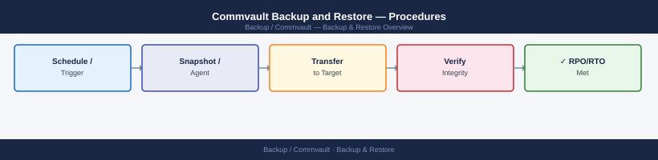
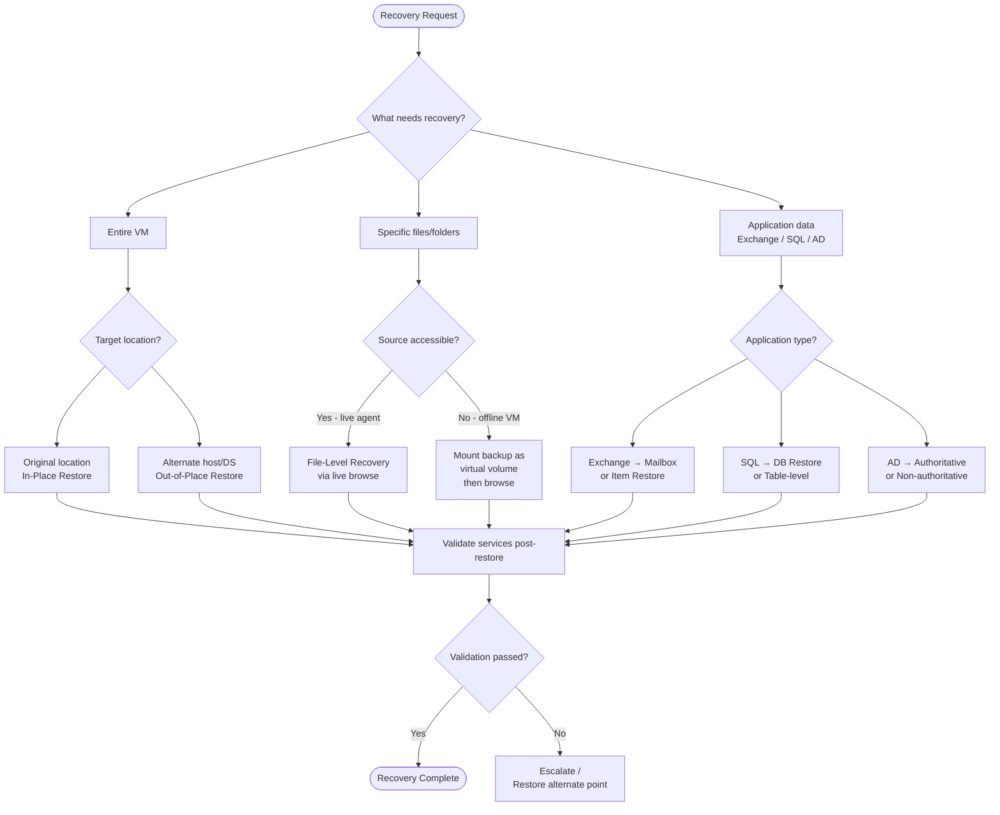
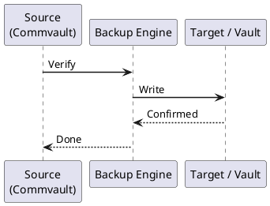

---
tags:
  - commvault
  - operations
---
# Commvault Backup and Restore — Procedures



```bash
curl -s -X POST "https://commserve.example.com/webconsole/api/Login" \
  -H "Content-Type: application/json" \
  -d '{"username":"admin","password":"<password>"}' | jq '.token'
```

```text
Subclient → Restore → In-Place → Overwrite existing data: Yes
```
```text
Subclient → Restore → Out-of-Place → Specify destination client and path
```
```bash
qoperation execscript -sn QS_ValidateCopy -si "StoragePolicyName" -si "CopyName"
```




## Before you begin

- **Access:** Backup admin role on backup server; target system credentials
- **Timing:** safe to run during business hours unless a step is marked ⚠ (causes interruption)
- **Dependencies:** no active upgrades or migrations on the same infrastructure
- **Logging:** capture command output — paste into the change record on completion

---

---

## Verify

- **Job status:** confirm backup job completed with status Success (not Warning)
- **Recovery test:** restore a single file or VM from the new backup to confirm restorability
- **Retention:** verify old recovery points are expiring per the configured retention policy

---

## See also

- [Commvault — Procedures](../procedures/)
- [Commvault — Health Checks](../health-checks/)
- [Commvault — Common Issues](../../troubleshooting/common-issues/)
