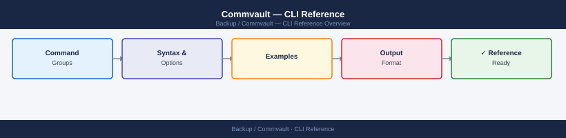
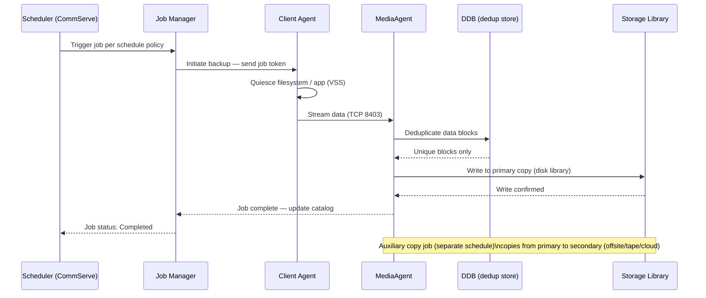
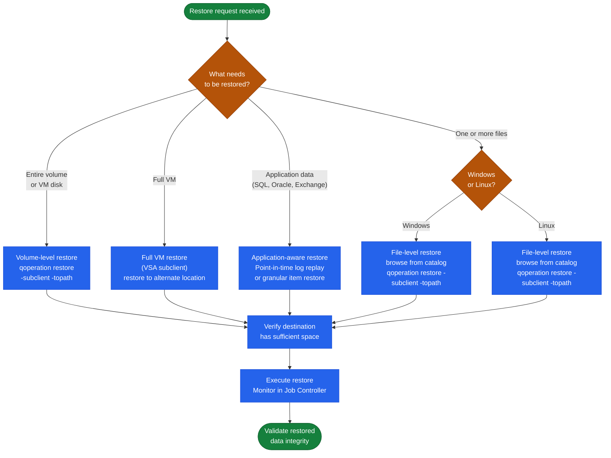

---
tags:
  - commvault
  - operations
---
# Commvault — CLI Reference


<div class="kb-summary">
CLI Reference reference covering Backup Job Lifecycle, Backup Operations, Restore Operations, Clients & Policies, CommServe Maintenance and 1 more sections.

*Applies to: Commvault 2024.x*
</div>



```d2
direction: right

center: "Commvault" {shape: rectangle}
backup_job_lifecycle: "Backup Job Lifecycle" {shape: rectangle}
restore_operations: "Restore Operations" {shape: rectangle}
clients_policies: "Clients & Policies" {shape: rectangle}
commserve_maintenance: "CommServe Maintenance" {shape: rectangle}
rest_api: "REST API" {shape: rectangle}
verify: "Verify" {shape: rectangle}

center -> backup_job_lifecycle
center -> restore_operations
center -> clients_policies
center -> commserve_maintenance
center -> rest_api
center -> verify
```

## Before you begin

- **Access:** Backup admin role on backup server; target system credentials
- **Timing:** safe to run during business hours unless a step is marked ⚠ (causes interruption)
- **Dependencies:** no active upgrades or migrations on the same infrastructure
- **Logging:** capture command output — paste into the change record on completion

---

## Backup Job Lifecycle

From schedule trigger to media write, every CommVault backup job moves through a defined sequence of states.




---

## Restore Operations

### Restore Workflow Decision Tree



Always verify destination and time range before executing a restore.

```bash
# Restore to original location at a point in time
qoperation restore -subclient <name> -totime "2024-01-01 12:00:00"

# Restore to alternate path
qoperation restore -subclient <name> -topath /restore/destination

# List recent restore jobs
qlist jobs -d 1 -restore
```

---

## Clients & Policies

Manage client registration, storage policies, and schedules.

```bash
# List all clients
qlist client

# List storage policies
qlist storagepolicy

# List schedules
qlist schedule

# List deduplication databases
qlist ddb

# Check client connectivity readiness
qoperation execscript -sn QS_CheckReadiness

# List backup sets for a client
qlist backupset -c <client_name>
```

---

## CommServe Maintenance

Database backup and health tasks for CommServe.

```bash
# Trigger CommServe database backup
qsystem dbbackup

# Commit pending configuration changes
qcommit

# Check CommServe services status
qlist services

# Check license usage
qlist license
```

---

## REST API

All operations are also available via REST API for automation.

```bash
# Authenticate and get token
curl -X POST "https://<CommServe>/webconsole/api/Login" \
  -H "Content-Type: application/json" \
  -d '{"username":"admin","password":"<password>","domain":""}'

# List all clients
curl -X GET "https://<CommServe>/webconsole/api/Client" \
  -H "Authtoken: <token>"

# List active jobs
curl -X GET "https://<CommServe>/webconsole/api/Job?jobFilter=Active" \
  -H "Authtoken: <token>"
```

---

## Verify

- **Job status:** confirm backup job completed with status Success (not Warning)
- **Recovery test:** restore a single file or VM from the new backup to confirm restorability
- **Retention:** verify old recovery points are expiring per the configured retention policy

---

## See also

- [Commvault — Procedures](../procedures/)
- [Commvault — Scripts](../scripts/)
- [Commvault — Health Checks](../health-checks/)
