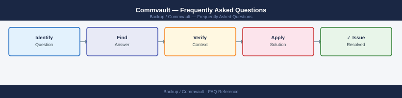

---
tags:
  - commvault
  - faq
  - operations
---
# Commvault — Frequently Asked Questions

<div class="kb-summary">
Common questions about Commvault operations, configuration, and troubleshooting. For step-by-step procedures, see the <a href="index.md">Operations</a> section.
</div>



```d2
direction: right

hub: "Commvault\nOperations" {shape: hexagon}
general: "General" {shape: rectangle}
configuration: "Configuration" {shape: rectangle}
operations: "Operations" {shape: rectangle}
troubleshooting: "Troubleshooting" {shape: rectangle}
backup_and_recovery: "Backup and Recovery" {shape: rectangle}

hub -> general
hub -> configuration
hub -> operations
hub -> troubleshooting
hub -> backup_and_recovery
```

## General

**Q: What Commvault version is recommended for new deployments?**
A: Commvault 11 SP32+ (Feature Release) for new installations. Check the CommServe version under CommCell Console → Help → About or run `qlogin` and check build info.

**Q: How do I check the current Commvault version?**
A: `qlogin -cs <hostname> -u admin`

## Configuration

**Q: What is the default deduplication setting and when should it change?**
A: DDB deduplication is enabled by default for disk libraries. Disable it only for already-compressed data (e.g., encrypted backups, video) where dedup ratio is below 1.1x.

**Q: How do I enable Commvault Air Gap Protect for immutable backups?**
A: Configure a Cloud Library pointing to an immutable object store (S3 Object Lock or Azure Immutable Blob). Set retention locks in the Storage Policy copy. Contact Commvault support for Air Gap Protect licensing.

## Operations

**Q: How do I upgrade Commvault across MediaAgents without disrupting jobs?**
A: Upgrade the CommServe first, then MediaAgents one at a time. Drain running jobs before upgrading each MA. Use the Commvault Update Manager (push upgrades) via CommCell Console → Software → Install/Update Software.

**Q: What is the correct procedure to add a new MediaAgent?**
A: Install the Commvault package on the new server, register it to the CommServe, then configure disk/tape libraries. Verify connectivity with `qping -cs <commserve>` from the new MA.

## Troubleshooting

**Q: Job shows 'Media Mount Timeout'. What does it mean?**
A: The MediaAgent cannot mount the required media within the timeout period. Check tape library door, drive availability, and scratch pool. For disk, verify the library path is accessible.

**Q: Backup throughput degraded after adding new clients — where do I start?**
A: Check MA resource utilisation (CPU, disk I/O). Review streams per Storage Policy. Verify network bandwidth between clients and MA. Check DDB store fragmentation — run DDB verification.

## Backup and Recovery

**Q: How often should I back up the CommServe database?**
A: Daily automated DR backups are configured by default. Verify under CommCell Console → CommServe → Disaster Recovery Backup. Store copies off-site. Test restore quarterly.

**Q: Can I restore a single file without a full job restore?**
A: Yes — use the Browse and Restore wizard in CommCell Console or the Web Console. Select the client, subclient, and point-in-time, then browse to the specific file or folder.

## See Also

- [Commvault Operations](index.md)
- [Commvault Troubleshooting](../../troubleshooting/index.md)
