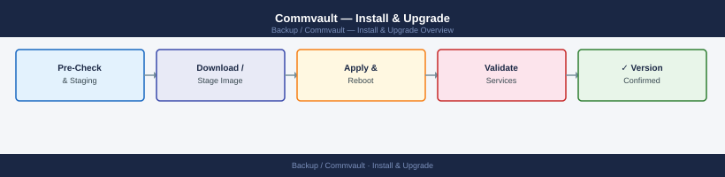

---
tags:
  - commvault
  - operations
---
# Commvault — Install & Upgrade


<div class="kb-summary">
Install & Upgrade reference covering Release Cadence, Upgrade Order, CommVault to Metallic SaaS Migration, EOL Tracking.

*Applies to: Commvault 2024.x*
</div>



```d2
direction: right

plan: "Plan" {shape: oval}
release_cadence: "Release Cadence" {shape: rectangle}
upgrade_order: "Upgrade Order" {shape: rectangle}
commvault_to_metallic_saas_migration: "CommVault to Metallic SaaS Migration" {shape: rectangle}
eol_tracking: "EOL Tracking" {shape: rectangle}
verify: "Verify" {shape: rectangle}
validate: "Validate" {shape: oval}

plan -> release_cadence
release_cadence -> upgrade_order
upgrade_order -> commvault_to_metallic_saas_migration
commvault_to_metallic_saas_migration -> eol_tracking
eol_tracking -> verify
verify -> validate
```

## Before you begin

- **Access:** Backup admin role on backup server; target system credentials
- **Timing:** safe to run during business hours unless a step is marked ⚠ (causes interruption)
- **Dependencies:** no active upgrades or migrations on the same infrastructure
- **Logging:** capture command output — paste into the change record on completion

---

## Release Cadence

CommVault releases Feature Releases (FRs) quarterly, each receiving Maintenance Releases (MRs/SPs) for approximately 12 months post-GA.

| Release Type | Cadence | Support Window |
|---|---|---|
| Feature Release (FR) | Quarterly | ~12 months of maintenance releases |
| Maintenance Release (MR) | As needed | Cumulative for the FR branch |
| Hotfix | On demand | Targeted; requires SR for delivery |

Check current version EOL: [documentation.commvault.com](https://documentation.commvault.com) → Product Lifecycle.

## Upgrade Order

### CommVault Upgrade Dependency Chain


Verify in Command Center: Jobs → Active Jobs — confirm no jobs stuck in queued state.

## CommVault to Metallic SaaS Migration

For cloud migration of on-premises CommVault to Metallic (SaaS):
1. Deploy Metallic Gateway appliance or Cloud Connector
2. Re-register existing clients to Metallic CommCell
3. Initial full backup to Metallic; daily incrementals going forward
4. Decommission on-premises CommServe after retention requirements satisfied

## EOL Tracking

| Item | Action |
|---|---|
| FR version | Alert when within 60 days of EOL; upgrade planning starts 90 days before |
| Windows Server OS (CommServe host) | Align CommServe OS lifecycle with CommVault support matrix |
| SQL Server (CommServe DB) | Track SQL Server EOL; upgrade requires CommVault testing |
| Hyperscale X firmware | Annual review against CommVault recommended firmware versions |

---

## Verify

- **Job status:** confirm backup job completed with status Success (not Warning)
- **Recovery test:** restore a single file or VM from the new backup to confirm restorability
- **Retention:** verify old recovery points are expiring per the configured retention policy

---

## See also

- [Commvault — Deploy](../../deploy/)
