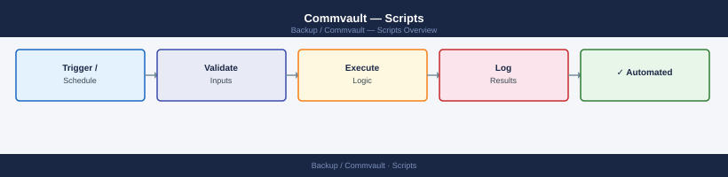

---
tags:
  - commvault
  - operations
---
# Commvault — Scripts

PowerShell and qscript automation for Commvault job management, SLA reporting, client health checks, and storage utilisation.

*Applies to: Commvault 2024.x*

## Before you begin

- **Access:** Backup admin role on backup server; target system credentials
- **Timing:** safe to run during business hours unless a step is marked ⚠ (causes interruption)
- **Dependencies:** no active upgrades or migrations on the same infrastructure
- **Logging:** capture command output — paste into the change record on completion

---

---

## Verify

- **Job status:** confirm backup job completed with status Success (not Warning)
- **Recovery test:** restore a single file or VM from the new backup to confirm restorability
- **Retention:** verify old recovery points are expiring per the configured retention policy

---

## See also

- [Commvault — Procedures](../procedures/)
- [Commvault — CLI Reference](../cli-reference/)
- [Commvault — Health Checks](../health-checks/)
