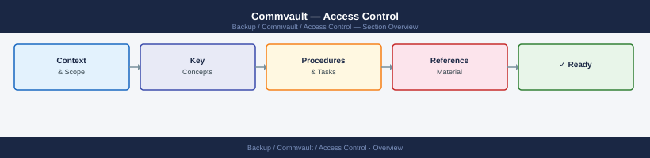

---
tags:
  - commvault
  - security
---
# Commvault — Access Control


<div class="kb-summary">
Commvault access control: RBAC role assignment, user group scoping, audit trail configuration, and MFA enforcement for CommCell Console and Web Console.

*Applies to: Commvault 2024.x*
</div>



Forward audit logs to SIEM via syslog:
- Command Center: Manage → Alerts → configure syslog destination
- Alert on: admin account creation, policy modifications, job deletion, encryption key access

```d2
direction: down

root: "Commvault\nAccess Control" {shape: hexagon}
administrator: "Administrator" {shape: rectangle}
operator: "Operator" {shape: rectangle}
auditor: "Auditor" {shape: rectangle}
readonly: "Read-Only" {shape: rectangle}
resources: Protected Resources {shape: cylinder}

root -> administrator: role
administrator -> resources: scoped
root -> operator: role
operator -> resources: scoped
root -> auditor: role
auditor -> resources: scoped
root -> readonly: role
readonly -> resources: scoped
```

## Before you begin

- **Access:** Backup admin role on backup server; target system credentials
- **Change management:** security changes require CAB approval in most environments
- **Rollback plan:** document current state before any security control change
- **Testing:** validate in a non-production environment first where possible

---

---

## See also

- [Commvault — Authentication](../authentication/)
- [Commvault — Hardening](../hardening/)
- [Commvault — Encryption](../encryption/)
