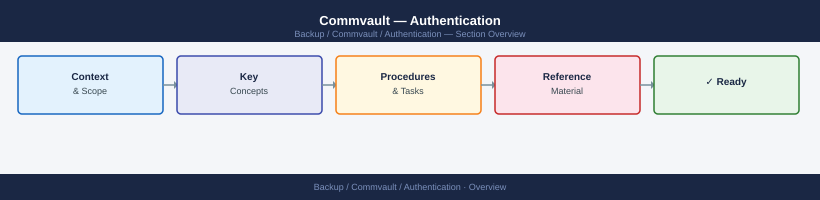
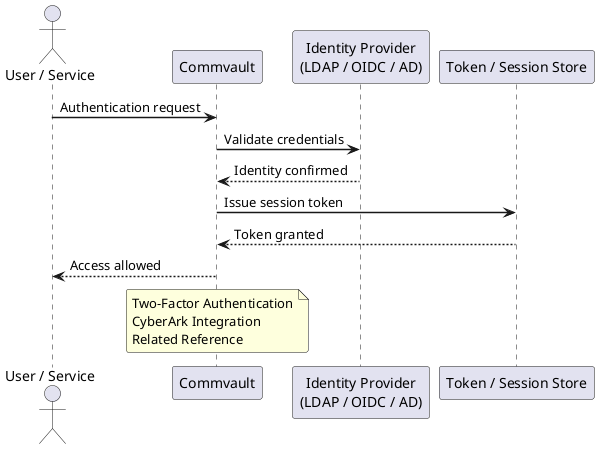

---
tags:
  - commvault
  - security
---
# Commvault — Authentication

Authentication reference covering Two-Factor Authentication, CyberArk Integration, Related Reference.

*Applies to: Commvault 2024.x*

## Before you begin

- **Access:** Backup admin role on backup server; target system credentials
- **Change management:** security changes require CAB approval in most environments
- **Rollback plan:** document current state before any security control change
- **Testing:** validate in a non-production environment first where possible

---

## Two-Factor Authentication

Enable 2FA for Command Center:
- Manage → Security → Identity Providers → configure SAML or TOTP
- Require MFA for all admin-level accounts
- Exempt automated service accounts (use dedicated service account with IP restriction instead)

## CyberArk Integration

CommVault supports CyberArk Central Credential Provider (CCP) for runtime password retrieval:

1. Command Center: Manage → Security → Credential Manager
2. Add credential → select CyberArk CCP as vault type
3. Configure: CCP URL, app ID, safe name, object name

Service account passwords never stored in CommVault config — retrieved from CyberArk at job runtime.
---

## Related Reference

- [Standard SAML Configuration](../../../../security/saml-configuration/index.md) — SP/IdP setup, Azure AD and Okta steps, attribute mapping, and security requirements

---

## See also

- [Commvault — Access Control](../access-control/)
- [Commvault — Hardening](../hardening/)
- [Commvault — Encryption](../encryption/)
