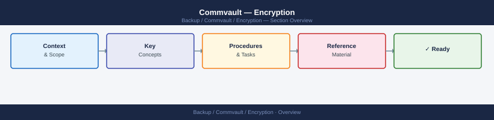

---
tags:
  - commvault
  - security
---
# Commvault — Encryption

Encryption reference covering Backup Encryption, Linux Hardened Repository (Immutable Backups).

*Applies to: Commvault 2024.x*

Configure via VBR Repository settings: enable "Immutable" with retention period matching recovery requirements.

## Before you begin

- **Access:** Backup admin role on backup server; target system credentials
- **Change management:** security changes require CAB approval in most environments
- **Rollback plan:** document current state before any security control change
- **Testing:** validate in a non-production environment first where possible

---

---

## See also

- [Commvault — Hardening](../hardening/)
- [Commvault — Authentication](../authentication/)
- [Commvault — Access Control](../access-control/)
