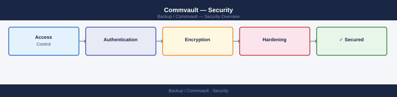

---
tags:
  - commvault
  - security
---
# Commvault — Security

Commvault hardening — RBAC, encryption keys, audit logging, CommServe access control, and network security configuration.

*Applies to: Commvault 2024.x*

<a class="kb-card" href="authentication/">
  <strong>Authentication</strong>
  2FA, SAML, TOTP, and CyberArk credential management.
</a>

<a class="kb-card" href="access-control/">
  <strong>Access Control</strong>
  RBAC roles, user groups, AD integration, and audit trail.
</a>

<a class="kb-card" href="encryption/">
  <strong>Encryption</strong>
  Backup encryption, immutable repositories, and key management.
</a>

<a class="kb-card" href="hardening/">
  <strong>Hardening</strong>
  Network security, port restrictions, and hardening checklist.
</a>

