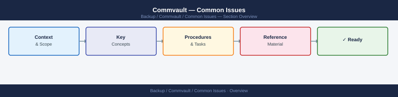
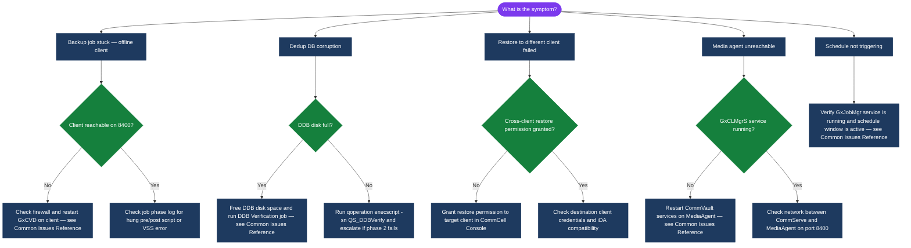

---
tags:
  - commvault
  - troubleshooting
search:
  boost: 1.5
---
# Commvault — Common Issues


<div class="kb-summary">
Common Commvault issues — backup job failures, media agent errors, deduplication problems, and client connectivity failures.

*Applies to: Commvault 2024.x*
</div>



CommVault job failures are classified by error code and phase. The first diagnostic step is to open the job detail in the Job Controller and expand the phase-level log — this shows the specific module and error code.

| Symptom | Likely Cause | Remediation |
|---|---|---|
| Job fails: network error (phase: backup) | MediaAgent cannot reach client on port 8400 | Check firewall rules; confirm client service is running (`cvd` daemon) |
| Job fails: DDB is offline | DDB disk full or corrupted | Check DDB disk space; run DDB verification; restore DDB from backup if corrupted |
| CommServe SQL errors | SQL Server disk full or SQL service issue | Check SQL Server disk; review SQL Server error log; free space or expand volume |
| Client authentication failure | Certificate mismatch or firewall blocking 8403 | Re-register client certificate; check `cvd` and `cvfwd` ports |
| MediaAgent offline | Service stopped or network issue | Restart CommVault services on MediaAgent; check `CVMA` service status |
| Auxiliary copy stuck | Source copy not pruned or tape library busy | Check tape drive availability; verify source data is not in use |
| DDB corruption | Unexpected shutdown during write | Run `qoperation execscript -sn QS_DDBVerify`; escalate if phase 2 fails |

```d2
direction: down

symptom: Identify Symptom {shape: diamond}
diagnostic_flow: "Diagnostic Flow" {shape: rectangle}
verify_resolution: "Verify resolution" {shape: rectangle}
resolution: Resolve or Escalate {shape: oval}

symptom -> diagnostic_flow: investigate
symptom -> verify_resolution: investigate
diagnostic_flow -> resolution
verify_resolution -> resolution
```

## Diagnostic Flow



---

## Before you begin

- **Access:** Backup admin role on backup server; target system credentials
- **Gather first:** recent error message text, event timestamps, and affected object names
- **Scope:** confirm whether the issue affects a single object, host, cluster, or site
- **Escalation:** open a vendor support ticket before running any destructive step
- **Logging:** document each command and output — required if escalation is needed

---

---

## Verify resolution

- Confirm the original symptom no longer occurs
- Check logs for any residual errors related to the issue
- Monitor for 10–15 minutes to confirm the fix is stable

---

## See also

- [Commvault — Diagnostics](../diagnostics/)
- [Commvault — Escalation](../escalation/)
- [Commvault — Health Checks](../../operations/health-checks/)
