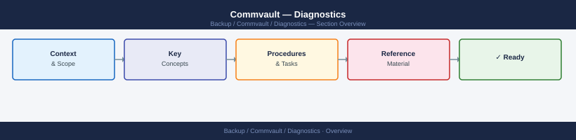
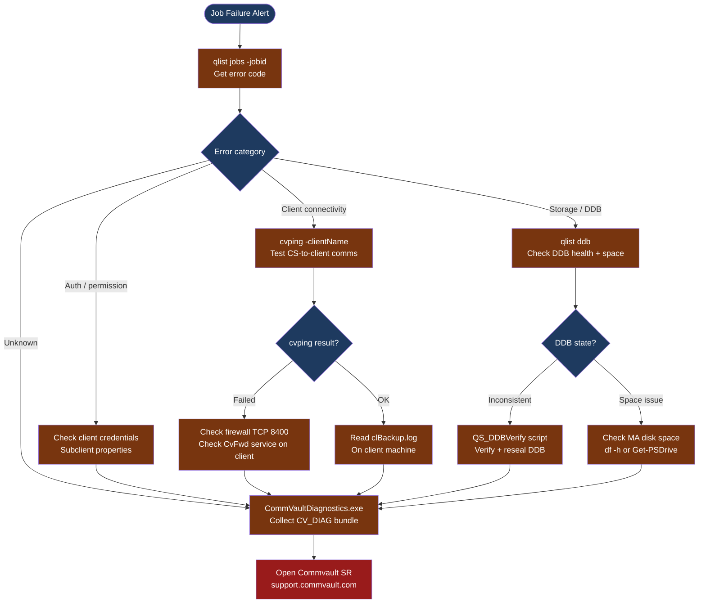

---
tags:
  - commvault
  - troubleshooting
search:
  boost: 1.5
---
# Commvault — Diagnostics

<div class="kb-summary">
Commvault diagnostic commands: identify job failures with qlist, test component connectivity with cvping, verify DDB health, read CommServe and MediaAgent logs, and collect the CV_DIAG bundle for Commvault support cases.

*Applies to: Commvault 2024.x / Commvault Cloud*
</div>





## Before you begin

- **Access:** CommServe admin credentials (Command Center or Java Console); SSH or RDP to CommServe, MediaAgent, and affected client systems
- **Gather first:** the Job ID (from Job Controller or email alert), the error code (4–5 digit number), and the affected client and subclient name
- **Scope:** confirm whether the failure affects a single client/subclient, all clients on one MediaAgent, or all jobs on the CommServe
- **Error codes:** search the Commvault documentation at `ma.commvault.com` with the error code before opening an SR — most codes have documented root causes and resolutions
- **Logging:** CV logs rotate at 10 MB by default; older logs archive to `.gz` files — check both current and archived logs for the time window of the failure

---

## Step 1 — Identify the failing job

```bash
# On the CommServe host — run from the CommVault installation bin directory
# Typical path: C:\Program Files\Commvault\ContentStore\Base\

# Get detailed job information by Job ID
qlist jobs -jobid <job-id> -verbose
# Output includes:
#   Status: Failed / Killed / Running
#   Error Code: <4-5 digit code>
#   Phase: which backup phase failed (scan, transfer, archive index, verify)
#   Client: affected client hostname
#   Subclient: policy name

# List recent failed jobs (last 24 hours)
qlist jobs -status failed -t "last 24 hrs"
# Output: Job ID, Status, Client, Subclient, Error Code, Start Time, End Time

# List all currently active jobs
qlist jobs -status running

# View job phase detail (useful for jobs that failed mid-stream)
qlist jobs -jobid <job-id> -phase
```

---

## Step 2 — Test connectivity to affected clients

Commvault uses TCP port 8400 (by default) for CommServe-to-client communication.

```bash
# Test CV connectivity from CommServe to a specific client
# Run from CommServe host
cvping -clientName <client-hostname>
# Expected: "Ping status successful" with round-trip time in milliseconds
# If fails: "Ping failed" — check network firewall and CV services on the client

# Test in reverse (from client to CommServe)
# Run on the client host
cvping -clientName <commserve-hostname>

# List all registered clients and their connectivity state
qlist client
# Output columns: Client Name, Host Name, Type, OS, Status
# Status: Ready = healthy; Offline = unreachable

# Show details for a specific client
qlist client -name <client-hostname> -verbose
# Shows: IP address, last heartbeat time, installed packages, proxy settings
```

**If cvping fails:**
1. Confirm TCP 8400 is open between CommServe and client (use telnet or Test-NetConnection)
2. On the client: verify `GxFWD` (CvFwd) service is running
   - Windows: `Get-Service GxFWD`
   - Linux: `systemctl status GxFWD` or `/opt/commvault/Base/GxFWD`
3. Check the client firewall (Windows Firewall or iptables) for port 8400

---

## Step 3 — Check MediaAgent and DDB health

```bash
# List all MediaAgents and disk libraries
qlist mediaagent
# Output: Name, Status, Index Cache Path, DDB Path

# List deduplication databases
qlist ddb
# Output columns: DDB ID, MA Host, DDB Path, Space Used, Space Free, Status
# Expected status: Online
# Alert: if DDB status = Offline or Resync Required

# List disk libraries with usage
qlist storage -type disk -verbose
# Shows: library name, mount path, space used, space available, MA host

# Check disk space on MediaAgent (run on the MA host)
# Windows:
Get-PSDrive -PSProvider FileSystem | Select-Object Name,
  @{n='UsedGB';e={[math]::Round($_.Used/1GB,1)}},
  @{n='FreeGB';e={[math]::Round($_.Free/1GB,1)}} | Format-Table

# Linux MediaAgent:
df -h /mnt/cv-disk-library/
```

**If DDB status is "Resync Required" or "Offline":**
1. Do not delete or move DDB files — this can cause data loss for all dedup-enabled backups on that MA
2. Run the DDB verification script: `qoperation execscript -sn QS_DDBVerify`
3. If DDB is full (space issue): add a new extent to the disk library in CommCell Console
4. Contact Commvault support before attempting DDB repair if uncertain

---

## Step 4 — Read log files

```bash
# CommServe main log (Windows path)
$logDir = "C:\CV\Log Files"
Get-ChildItem $logDir | Sort-Object LastWriteTime -Descending | Select-Object -First 10

# Search CommServe log for errors
Select-String -Path "$logDir\CommServe.log" -Pattern "error|fail|exception" -CaseSensitive:$false |
  Select-Object -Last 100

# Job Manager service log (shows job dispatch errors)
Select-String -Path "$logDir\GxJobMgrService.log" -Pattern "error|fail" -CaseSensitive:$false |
  Select-Object -Last 50

# MediaAgent log (run on the MA host)
Select-String -Path "$logDir\MediaAgent.log" -Pattern "error|fail" -CaseSensitive:$false |
  Select-Object -Last 100

# Client-side backup log (run on the client host)
# Windows client:
Select-String -Path "C:\CV\Log Files\clBackup.log" -Pattern "error|fail" -CaseSensitive:$false |
  Select-Object -Last 100

# Linux client:
grep -i "error\|fail" /var/log/commvault/Log_Files/clBackup.log | tail -100
```

---

## Step 5 — Collect CV_DIAG support bundle

```text
Method 1: CommVault Diagnostics Tool (Windows — on CommServe)
  1. Open Command Prompt as Administrator
  2. Navigate to CommVault install dir: cd "C:\Program Files\Commvault\ContentStore\Base"
  3. Run: CommVaultDiagnostics.exe -collect all
  4. Output path is shown after collection; typically: C:\CV_DIAG\<timestamp>\
  5. The bundle includes: all component logs, config (credentials sanitised), system info

Method 2: Command Center (for CommVault Cloud / newer versions)
  1. Navigate to: Command Center → Manage → Diagnostics
  2. Click "Download Diagnostics" and select the affected components
  3. Download the resulting ZIP file

Always include:
  - Job ID(s) of the failing jobs
  - Error code from qlist jobs output
  - Log files from the time window of the failure
  - DDB status from qlist ddb
```

---

## Log locations

| Component | Windows Path | Linux Path |
|---|---|---|
| CommServe | `C:\CV\Log Files\CommServe.log` | `/var/log/commvault/Log_Files/CommServe.log` |
| Job Manager | `C:\CV\Log Files\GxJobMgrService.log` | `/var/log/commvault/Log_Files/GxJobMgrService.log` |
| MediaAgent | `C:\CV\Log Files\MediaAgent.log` | `/var/log/commvault/Log_Files/MediaAgent.log` |
| Client backup | `C:\CV\Log Files\clBackup.log` | `/var/log/commvault/Log_Files/clBackup.log` |
| Index Server | `C:\CV\Log Files\CVIndexServer.log` | `/var/log/commvault/Log_Files/CVIndexServer.log` |

---

## See also

- [Commvault — Common Issues](../common-issues/)
- [Commvault — Escalation](../escalation/)
- [Commvault — Health Checks](../../operations/health-checks/)

## Verify resolution

- `qlist jobs -status failed -t "last 24 hrs"` shows no new failures for the affected client/subclient
- `cvping -clientName <host>` returns "Ping status successful" for all previously unreachable clients
- `qlist ddb` shows all DDBs in `Online` state
- Run a manual backup of the affected subclient from Command Center → confirm it completes with `Completed` status
- Monitor Job Controller for 24 hours to confirm no re-occurrence
