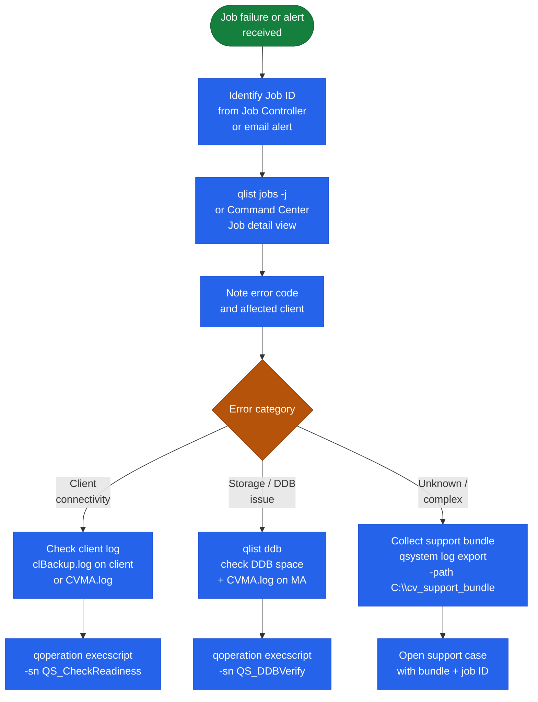

---
tags:
  - commvault
  - troubleshooting
---
# Commvault — Diagnostics


<div class="kb-summary">
Diagnostics reference covering Diagnostic Flow.

*Applies to: Commvault 2024.x*
</div>

## Before you begin

- **Access:** Backup admin role on backup server; target system credentials
- **Gather first:** recent error message text, event timestamps, and affected object names
- **Scope:** confirm whether the issue affects a single object, host, cluster, or site
- **Escalation:** open a vendor support ticket before running any destructive step
- **Logging:** document each command and output — required if escalation is needed

---

## Diagnostic Flow


```text
┌──────────────────────────── Commvault Diagnostics — Logs, Tools, Commands ────────────────────────────┐
│                                                                                                       │
│   ┌──────────────────────────────────────────────┐  ┌─────────────────────────────────────────────┐   │
│   │              Log File Locations              │  │               Diagnostic Tools              │   │
│   │      CS: C:\CV\Log Files\CommServe.log       │  │      CV_DIAG: collect all logs + config     │   │
│   │      MA: C:\CV\Log Files\MediaAgent.log      │  │        CommVaultDiagnostics.exe on CS       │   │
│   │         JobMgr: GxJobMgrService.log          │  │     cvping: test component connectivity     │   │
│   │     Client: C:\CV\Log Files\clBackup.log     │  │      cvdiskperf: benchmark MA disk I/O      │   │
│   │     Linux: /var/log/commvault/Log_Files/     │  │     cvnetwork: test MA network bandwidth    │   │
│   └──────────────────────────────────────────────┘  └─────────────────────────────────────────────┘   │
│                                                                                                       │
│    Always collect CV_DIAG before opening a support case; include job ID and error code                │
│                                                                                                       │
│                                                   ▼                                                   │
│                                                                                                       │
│   ┌───────────────────────────────────────────────────────────────────────────────────────────────┐   │
│   │                                    Key Diagnostic Commands                                    │   │
│   │                 qlist jobs -jobid <id> -verbose       → detailed job phase log                │   │
│   │               qlist client -name <host>             → client registration status              │   │
│   │            qlist storage -type disk -verbose     → disk library mount paths + usage           │   │
│   │             cvping -clientName <host>             → test CS-to-client connectivity            │   │
│   │            CommVaultDiagnostics.exe -collect all → generate full diagnostic bundle            │   │
│   └───────────────────────────────────────────────────────────────────────────────────────────────┘   │
│                                                                                                       │
│  Physical Infrastructure:                                                                             │
│  Log rotation: CV logs rotate at 10 MB by default; 30-day retention                                   │
│  Disk for logs: CommServe log partition should be separate from CSDB partition                        │
│                                                                                                       │
│  Key terms:                                                                                           │
│                                                                                                       │
│  CV_DIAG        = Diagnostic bundle: all component logs, config exports, event logs                   │
│  cvping         = CommVault connectivity test tool (not ICMP ping; tests CV comms)                    │
│  cvdiskperf     = Measures sequential read/write performance of MA disk library path                  │
│  cvnetwork      = Tests throughput and latency between CommVault components                           │
│  clBackup.log   = Client-side backup agent log; shows pre/post scripts, CBT activity                  │
│  GxJobMgrSvc    = CommServe Job Manager service log; shows job dispatch and errors                    │
│  MediaAgent.log = MA-side data pipeline log; shows dedup, compress, write operations                  │
│  CommServe.log  = Main CommServe service log; CS startup, DB queries, scheduler                       │
│  Job Phase      = Individual step within a backup job (scan, transfer, dedup, write)                  │
│  Error Code     = 4-5 digit CV error; search on ma.commvault.com for KB resolution                    │
│  -verbose flag  = qlist flag enabling detailed per-object output for all list commands                │
│  Log Rotation   = Commvault auto-rotates logs at size limit; old logs archived to .gz                 │
└───────────────────────────────────────────────────────────────────────────────────────────────────────┘
```
