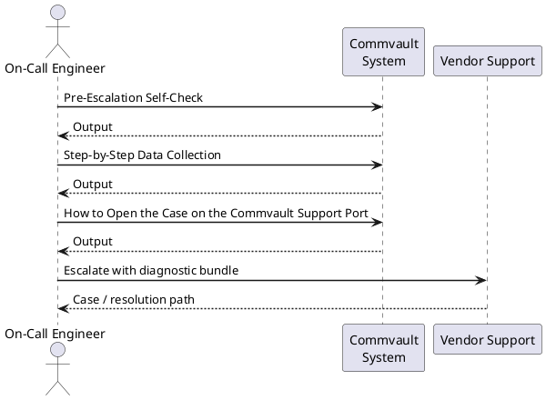
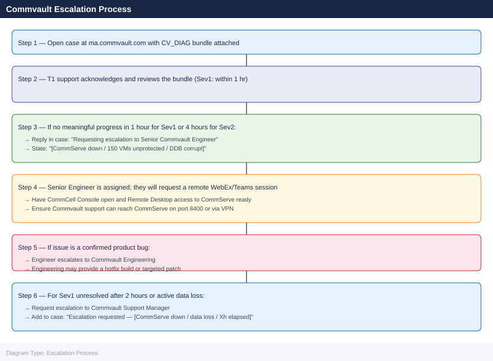

---
tags:
  - commvault
  - troubleshooting
search:
  boost: 1.5
---
# Commvault — Escalation

<div class="kb-summary">
How to escalate Commvault backup issues to Commvault support: what data to collect, how to generate the CV_DIAG bundle, step-by-step case creation on the Commvault portal, and the escalation path when progress stalls.

*Applies to: Commvault 2024.x / CS 11.x*
</div>

---



## Before you begin

- **Access required:** Commvault Administrator role on CommServe; access to CommCell Console; Commvault support account at ma.commvault.com with active support entitlement
- **Do this first:** collect the CV_DIAG bundle before restarting any services or changing configuration. Commvault support will ask for it in their first response
- **Do NOT restart all GxCVD services** at once without guidance — CommServe may be in the middle of an operation; a mass restart can corrupt job state
- **Do NOT run DDB repair** without Commvault directing you to. An incorrect DDB repair can make deduplication data unreadable

---

## Pre-Escalation Self-Check

Run these before opening the case. Many Commvault issues are resolvable without vendor support.

| Check | Where to look | Expected result |
|---|---|---|
| CS version + SP | CommCell Console → Help → About | Note full version (e.g. 11.24 SP10) |
| CommServe service | Windows Services on CommServe host: GxCVD | Running |
| Job failures | CommCell Console → Job Activity Controller | Note failing Job IDs and exact error |
| SQL Server status | Services: SQL Server (Commvault) | Running |
| CommServe DB size | SQL: `SELECT SUM(size)*8/1024 FROM CommServ.sys.database_files` (MB) | Not at max allocated size |
| Disk space on CommServe | `df -h` or `Get-PSDrive` on CommServe host | `C:\` (or install drive) above 15% free |
| MediaAgent status | CommCell Console → Storage Resources → MediaAgents | All MAs show Connected (green) |
| Library space | CommCell Console → Storage Resources → Disk Libraries | Free space > 15% |
| DDB status | CommCell Console → Storage Resources → Deduplication Databases | All DBs show Enabled; no Corrupted |

---

## Step-by-Step Data Collection

### 1. Get the CommServe version and CommCell ID

In CommCell Console: click the **Help** menu → **About CommCell**. Note:
- **Version**: e.g. `Commvault 11.24.0` 
- **Service Pack**: e.g. `SP10`
- **CommCell ID**: the numeric ID shown at the bottom — required for the support case entitlement check

### 2. Get the failing Job ID and exact error text

1. In CommCell Console, click **Job Activity Controller** (or **Reports** → **Job Summary**).
2. Right-click the failing job → **View Events**.
3. Find the error event and copy the full error message text, including the Commvault error code (e.g. `[CVU4015] Failed to connect to MediaAgent...`).
4. Note the **Job ID** shown in the job list (a numeric ID like `84321`).

### 3. Collect the CV_DIAG bundle

1. In CommCell Console: click the **Help** menu → **Diagnostics and Usage Information**.
2. Click **Collect Diagnostic Information**.
3. In the wizard:
   - Select **CommServe** and any **MediaAgents** involved in the failing jobs
   - Select the **Time Range** covering the failure period (start 1 hour before the first failure)
   - Tick **Include Job Logs** and enter the failing Job ID(s) in the job ID field
   - Click **Collect**
4. The wizard packages logs, configuration, and database state into a ZIP file.
5. Default output location: `C:\Program Files\Commvault\ContentStore\Logs\DiagnosticFiles\`

This ZIP file is the most important attachment for the support case.

### 4. Collect the CommServe service log (for service-level failures)

If CommServe services are down or failing to start:

```powershell
# CommServe main service log location
$logdir = "C:\Program Files\Commvault\ContentStore\Log Files\"

# Most recent CS log
Get-ChildItem "$logdir\CommServ.log" | Select-Object Name, Length, LastWriteTime

# Copy the most recent log to a temp location
Copy-Item "$logdir\CommServ.log" "C:\Temp\CommServ-$(Get-Date -Format 'yyyyMMdd').log"

# Also collect the GxCVD Windows Event entries
Get-EventLog -LogName Application -Source "*Commvault*" -Newest 50 |
  Select-Object TimeGenerated, EntryType, Source, EventID, Message |
  Out-File "C:\Temp\commvault-events-$(Get-Date -Format 'yyyyMMdd').txt"
```

### 5. Write the timeline

```text
CommServe version: 11.24.0 SP10
CommCell ID: 12345
CommServe host: cs01.corp.local
Issue first observed: 2026-06-14 02:15 UTC (nightly backup run)
Last known good backup: 2026-06-13 02:30 UTC
Changes in 24h before the issue:
  - 2026-06-13 20:00: CommServe SP9 → SP10 upgrade applied
  - 2026-06-14 02:15: All backup jobs failed with error CVU4015
  - 2026-06-14 02:30: CommServe service shows Running; MAs show Connected in console
Error: [CVU4015] Failed to connect to MediaAgent ma01.corp.local
Job IDs failing: 84321, 84322, 84323 (all production backup jobs)
Steps already taken:
  - Confirmed MA service is running on ma01.corp.local
  - Checked network: CommServe can ping ma01.corp.local
  - Did NOT restart any services or run DDB repair
Blast radius: All 150 production VMs unprotected for 24h; restore not tested
```

---

## How to Open the Case on the Commvault Support Portal

1. Go to **ma.commvault.com** and sign in with your Commvault account. If you do not have one: click **Register** and use your company email — entitlement is linked to your CommCell ID and support contract.

2. Click **Create a Case** or navigate to **Support** → **Open a Case**.

3. Under **Product**, select **Commvault Complete** (or your specific Commvault product).

4. Under **Version**, select your CommServe version and SP level.

5. Under **CommCell ID**, enter the numeric ID from Step 1. This is required to validate your support entitlement.

6. Under **Severity**, select:
   - **Severity 1 — Critical**: CommServe is completely down; all backup jobs are failing; an active restore is failing in a DR scenario; no workaround
   - **Severity 2 — High**: A significant subset of jobs is failing; a critical backup chain is broken; DDB is showing corruption warnings; data protection gap exists
   - **Severity 3 — Medium**: Some jobs failing with a workaround available; single MediaAgent issue; non-critical data not being backed up
   - **Severity 4 — Low**: How-to question, pre-upgrade planning, or non-urgent configuration review

7. In the **Summary** field: product + symptom + scope. Example: `CV 11.24 SP10 — all backup jobs failing with CVU4015 after SP upgrade, 150 VMs unprotected`.

8. In the **Description** field, paste:
   - CommServe version and SP level from Step 1
   - CommCell ID
   - The exact error text and Job IDs from Step 2
   - The timeline from Step 5

9. Under **Attachments**, upload the CV_DIAG bundle ZIP from Step 3. If the file exceeds 2 GB, the portal will provide an FTP upload link.

10. Click **Submit**. You will receive a case number by email immediately.

11. **Severity 1 only:** call Commvault support after submission:
    - Find the phone number at **ma.commvault.com → Support → Contact Support** (regional numbers vary)
    - State "Severity 1 — CommServe down / all backups failing" at the start of the call.

---

## Escalation Path



---

## What NOT to Do

| Do NOT do this | Why | What to do instead |
|---|---|---|
| Run DDB repair without Commvault guidance | Can make deduplication data unreadable if run incorrectly | Describe the DDB status in the case; let Commvault direct the exact repair command |
| Delete failed jobs from Job History | Destroys the diagnostic data Commvault needs; error events are tied to the job record | Leave Job History intact; just note the Job IDs in the case |
| Restart all GxCVD services at once | May abort an in-progress operation; can corrupt job state | Only restart specific services if Commvault instructs you to |
| Upgrade CommServe mid-incident | Adds variables; may change log format; upgrade may be blocked by the current issue | Freeze all upgrades until the case is resolved |
| Clear Commvault log files | Destroys the CV_DIAG content Commvault support needs | Export CV_DIAG first; do not clear logs during the case |
| Rebuild the DDB index without guidance | Full index rebuild may fail if underlying disk is faulty | Report DDB state to Commvault; let them direct the recovery |

---

## Useful Commands for Case Updates

```powershell
# CommServe service status (on CommServe host)
Get-Service GxCVD,GxIMON,GxFWD | Select-Object Name, Status, StartType

# CommServe log — recent errors
$log = "C:\Program Files\Commvault\ContentStore\Log Files\CommServ.log"
Select-String -Path $log -Pattern "error|fail|exception" | Select-Object -Last 50

# MediaAgent service status (on each MA host)
Get-Service GxCVD | Select-Object Name, Status

# Disk space on backup repositories
Get-PSDrive -PSProvider FileSystem | Select-Object Name, @{N='UsedGB';E={[math]::Round($_.Used/1GB,1)}}, @{N='FreeGB';E={[math]::Round($_.Free/1GB,1)}}

# CommServe DB size (run in SQL Server Management Studio on CommServe SQL instance)
# SELECT name, SUM(size)*8/1024 AS 'SizeMB' FROM sys.database_files GROUP BY name
```

---

## Support SLA Reference

| Severity | Definition | Initial Response SLA |
|---|---|---|
| Sev 1 — Critical | CommServe down; all jobs failing; active restore failure | 1 hour (24×7) |
| Sev 2 — High | Significant subset of jobs failing; DDB warnings; restore degraded | 4 hours (24×7) |
| Sev 3 — Medium | Some jobs failing; limited impact; workaround exists | Next business day |
| Sev 4 — Low | How-to, pre-upgrade, non-urgent configuration | Best effort |

---

## See also

- [Commvault — Diagnostics](../diagnostics/)
- [Commvault — Common Issues](../common-issues/)

---

## Verify resolution

- Run `Get-Service GxCVD | Select-Object Name, Status` on CommServe and all MAs — all show Running
- Manually trigger a backup job for one of the previously failing workloads and confirm it completes with `Completed` status
- Check CommCell Console → Job Activity Controller and confirm no jobs show `Failed` status
- Verify DDB status: CommCell Console → Storage Resources → Deduplication Databases — all show `Enabled`
- Check CommCell Console → Storage Resources → MediaAgents — all MAs show Connected (green)
- Monitor the next two scheduled backup runs to confirm the fix is stable before closing the case
