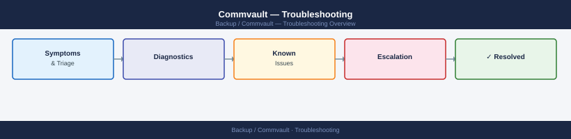

---
tags:
  - commvault
  - troubleshooting
search:
  boost: 1.5
---
# Commvault — Troubleshooting

Diagnosing Commvault job failures, media agent connectivity, subclient errors, schedule issues, and restore failures.

*Applies to: Commvault 2024.x*

<a class="kb-card" href="common-issues/">
  <strong>Common Issues</strong>
  Job failures, DDB errors, authentication failures, and MediaAgent issues.
</a>

<a class="kb-card" href="diagnostics/">
  <strong>Diagnostics</strong>
  Log locations, diagnostic commands, and support bundle collection.
</a>

<a class="kb-card" href="escalation/">
  <strong>Escalation</strong>
  Vendor support portal, case requirements, and support tiers.
</a>

