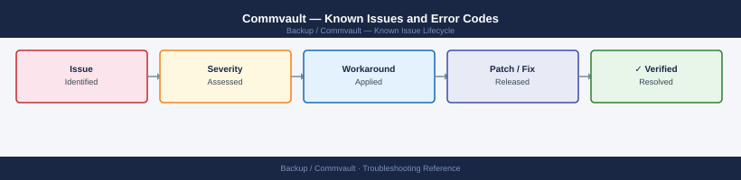

---
tags:
  - troubleshooting
  - commvault
  - backup
  - known-issues
---
# Commvault — Known Issues and Error Codes

<div class="kb-summary">
Catalog of known Commvault bugs, error codes, and workarounds covering backup jobs, media agents, and VSA (VMware) integration.

*Applies to: Commvault 11.x (Feature Release)*
</div>



```d2
direction: down

symptom: Identify Symptom {shape: diamond}
vmware_vsa: "VMware (VSA)" {shape: rectangle}
media_agents: "Media Agents" {shape: rectangle}
commserve: "CommServe" {shape: rectangle}
resolution: Resolve or Escalate {shape: oval}

symptom -> vmware_vsa: investigate
symptom -> media_agents: investigate
symptom -> commserve: investigate
vmware_vsa -> resolution
media_agents -> resolution
commserve -> resolution
```

## Before you begin

- Commvault errors appear in CommCell Console → Job Controller → Failed jobs — expand for event log.
- Commvault KB at `documentation.commvault.com`.
- Run `cvpkgadd` diagnostics or `commvault restart` service tool for service-level issues.

## VMware (VSA)

| Error / Symptom | Affected Versions | Cause | Workaround / Fix | Fixed In |
|---|---|---|---|---|
| VSA backup fails: `Snapshot operation failed` | Commvault 11.x | ESXi host overloaded; snapshot quiesce timeout | Reduce concurrent VSA streams; increase snapshot timeout in VSA properties | N/A |
| `Access denied` connecting to vCenter | Commvault 11.x | vCenter credentials changed or account locked | Update vCenter credentials in CommCell → Client Computers → vCenter Client | N/A |
| VSA restore fails: `Cannot find datastore` | Commvault 11.x | Datastore name changed or removed | Update restore destination in job restore wizard | N/A |

## Media Agents

| Error / Symptom | Affected Versions | Cause | Workaround / Fix | Fixed In |
|---|---|---|---|---|
| Media agent `Offline` in CommCell | Commvault 11.x | Commvault services not running on MA host | Restart Commvault services: `commvault restart` (Linux) or Services.msc (Windows) | N/A |
| Backup job fails: `Cannot connect to media agent port 8400` | Commvault 11.x | TCP 8400 blocked between CommServe and MA | Verify TCP 8400 open; check MA firewall | N/A |
| DD Boost integration failing | Commvault 11.x | DD Boost user not enabled or port 2052 blocked | Enable DD Boost user on Data Domain; verify TCP 2052 from MA to DD | N/A |

## CommServe

| Error / Symptom | Affected Versions | Cause | Workaround / Fix | Fixed In |
|---|---|---|---|---|
| `CommServe database maintenance` blocking jobs | Commvault 11.x | CSDB maintenance window running during business hours | Reschedule CSDB maintenance to off-peak window | N/A |
| License `Capacity exceeded` alarm | Commvault 11.x | Frontend capacity above licensed tier | Review capacity reporting; purchase additional license capacity | N/A |

## See also

- [Commvault — Common Issues](../common-issues/)
- [Dell Data Domain — Known Issues](../../../storage/dell/data-domain/troubleshooting/known-issues.md)
