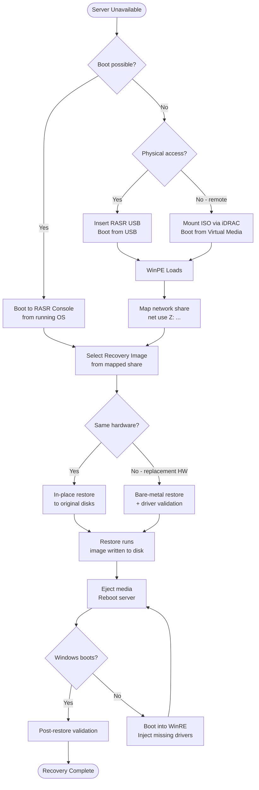

# RASR — Backup & Restore

```cmd
:: Basic image to network share
rasrutil.exe /backup /dest \\nas01\rasr-images\SERVER01 /user DOMAIN\svc-rasr /pass P@ssw0rd!

:: With compression and verbose output
rasrutil.exe /backup /dest \\nas01\rasr-images\SERVER01 /compress /log C:\Logs\rasr-backup.log /user DOMAIN\svc-rasr /pass P@ssw0rd!
```
```text
┌─────────────────────────────────────── RASR — Backup & Restore ───────────────────────────────────────┐
│                                                                                                       │
│    Backup flow: quiesce source → snapshot/copy → transfer → write to target → catalog                 │
│                                                                                                       │
│   ┌──────────────────────────────────────────────┐  ┌─────────────────────────────────────────────┐   │
│   │             Backup (Protection)              │  │              Restore (Recovery)             │   │
│   │              cr_vault_cli sync               │  │             cr_vault_cli status             │   │
│   │              Quiesce source I/O              │  │            Select recovery point            │   │
│   │             Take snapshot / CBT              │  │           Mount or copy to target           │   │
│   │           Transfer changed blocks            │  │              Validate integrity             │   │
│   │             Commit to repository             │  │             Restart application             │   │
│   └──────────────────────────────────────────────┘  └─────────────────────────────────────────────┘   │
│                                                                                                       │
│   ┌───────────────────────────────────────────────────────────────────────────────────────────────┐   │
│   │                                       Key RASR Commands                                       │   │
│   │                               Backup trigger  : cr_vault_cli sync                             │   │
│   │                              List points     : cr_vault_cli status                            │   │
│   │                                Health status   : cybersense scan                              │   │
│   │                                Retention mgmt  : ppdm recover vm                              │   │
│   └───────────────────────────────────────────────────────────────────────────────────────────────┘   │
│                                                                                                       │
│  Physical Infrastructure:                                                                             │
│  Isolated network segment (airgap switch) · Vault PowerStore/DD appliance · Clean-room ESXi hosts     │
│  Key terms:                                                                                           │
│                                                                                                       │
│  RASR          = Ransomware Air-gap Secure Recovery; full workflow from detection to clean rest       │
│  Vault         = isolated, air-gapped storage appliance receiving periodic replication copies         │
│  Vault Lock    = WORM lock applied after sync; prevents modification or deletion of vault copies      │
│  CyberSense    = ML analytics engine scanning vault data for corruption, encryption signatures        │
│  PPDM          = PowerProtect Data Manager; orchestrates protection policies, jobs, and recovery      │
│  Air Gap       = physical or logical network isolation preventing attacker lateral movement to        │
│  Delta Set     = incremental changed blocks replicated from production to vault each cycle            │
│  Clean Room    = isolated recovery environment: separate vCenter, network, and workstations           │
│  Recovery Point= specific vault snapshot timestamp from which clean recovery is performed             │
│  Integrity Lock= two-person authorization required to open vault; prevents insider unlock attac       │
│  Journal       = write-order-consistent journal on vault enabling point-in-time recovery              │
│  Scan Report   = CyberSense output: clean/suspect classification per file and block                   │
│  Retention     = vault copy lifespan; typically 30–90 days of daily snapshots kept                    │
│  RTO           = Recovery Time Objective; time from failover decision to restored service             │
│                                                                                                       │
└───────────────────────────────────────────────────────────────────────────────────────────────────────┘
```
```cmd
net use Z: \\nas01.example.com\rasr-images /user:DOMAIN\svc-rasr P@ssw0rd!
```
```cmd
dir Z:\SERVER01\
```
```cmd
:: In WinPE — inject missing driver
Dism /Image:C:\ /Add-Driver /Driver:X:\drivers\perc_h755.inf
```

