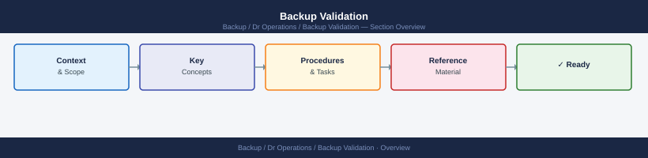
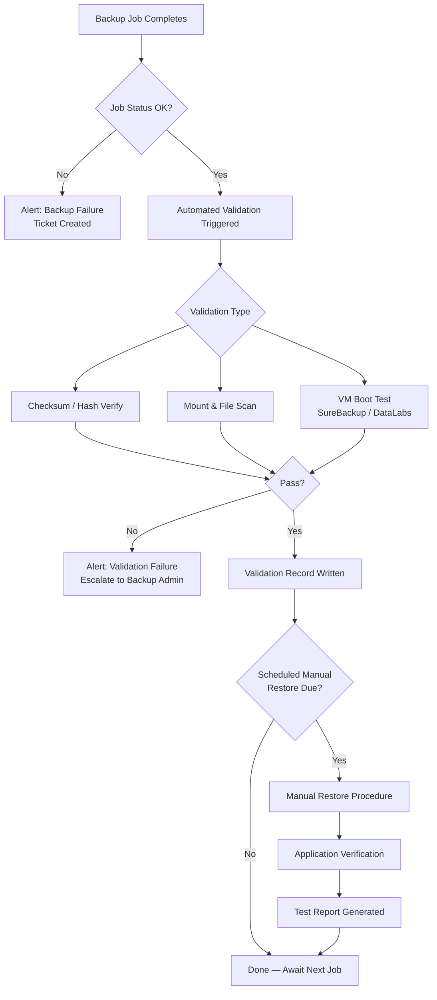

---
tags:
  - dr
---
# Backup Validation


<div class="kb-summary">
Backup validation is the systematic process of confirming that backup data is intact, recoverable, and meets defined recovery objectives. A backup that has never been tested is an untested assumption — validation converts assumptions into evidence.
</div>



---

```d2
direction: right

center: "DR Operations" {shape: hexagon}
validation_strategy_automated_vs_man: "Validation Strategy: Automated vs Manual" {shape: rectangle}
validation_workflow: "Validation Workflow" {shape: rectangle}
commvault_synthetic_full_verificatio: "Commvault — Synthetic Full Verification" {shape: rectangle}
netbackup_bpverify_command_reference: "NetBackup — `bpverify` Command Reference" {shape: rectangle}
validation_schedule: "Validation Schedule" {shape: rectangle}
test_restore_procedure: "Test Restore Procedure" {shape: rectangle}

center -> validation_strategy_automated_vs_man
center -> validation_workflow
center -> commvault_synthetic_full_verificatio
center -> netbackup_bpverify_command_reference
center -> validation_schedule
center -> test_restore_procedure
```

## Validation Strategy: Automated vs Manual

| Dimension | Automated Validation | Manual Validation |
|---|---|---|
| Frequency | Every backup job (daily/hourly) | Quarterly or on-demand |
| Scope | Checksums, mount verification, VM boot | Full application test, user acceptance |
| Effort | Near-zero operational overhead | Planned exercise, resource-intensive |
| Coverage | All jobs — broad but shallow | Subset of jobs — narrow but deep |
| Tools | Veeam SureBackup, Commvault Snapshot Verify, NBU bpverify | Runbook-driven manual restores |
| Evidence | Automated report in job log | Test report, sign-off document |

The recommended approach is **automated validation for every backup job** combined with **scheduled manual restores** on a defined calendar.

---

## Validation Workflow




Expected output columns: `Name` (VM name), `Status` (Success / Warning / Failed), timing. Any `Failed` row requires immediate investigation and re-run after remediation.

---

## Commvault — Synthetic Full Verification

Commvault's Data Verification runs data integrity checks on backup images stored in the CommVault MediaAgent without requiring a full restore.

```powershell
# Trigger Data Verification from CommVault PowerShell SDK
$client = Get-CVClient -Name "SQL-PROD-01"
$subClient = Get-CVSubClient -ClientName "SQL-PROD-01" -AppName "SQL Server" -Name "default"

# Queue a Data Verification job
Start-CVDataVerification -ClientName "SQL-PROD-01" `
    -SubClientName "default" `
    -AppName "SQL Server" `
    -VerificationType "DataOnly"
```

For GUI-driven verification: **CommCell Console → Backup Sets → Right-click subclient → Data Verification → Run Now**.

Verification checks:
- Block-level checksum validation of all backup chunks
- Deduplication store integrity
- Encrypted backup key accessibility

---

## NetBackup — `bpverify` Command Reference

`bpverify` reads backup images from media and verifies data integrity without writing to disk. It is the primary validation tool in NetBackup environments.

```bash
# Verify the most recent backup for a client
bpverify -client sql-prod-01.example.local -back_id 0 -st FULL

# Verify a specific backup image by backup ID
bpverify -id 1716800000 -client sql-prod-01.example.local

# Verify all backups in a date range
bpverify -client sql-prod-01.example.local \
  -s 05/01/2026 00:00:00 \
  -e 05/08/2026 23:59:59

# Verify and output results to a log file
bpverify -client sql-prod-01.example.local -back_id 0 \
  -st FULL -l /var/log/netbackup/verify_$(date +%F).log

# Check verification status / exit code
echo "Exit code: $?"
# 0 = success, 1 = partial failure, 2 = failure
```

### `bpverify` Exit Code Reference

| Code | Meaning | Action |
|---|---|---|
| 0 | Verification successful | Log and proceed |
| 1 | Partial failure — some files unreadable | Investigate media; attempt re-verification |
| 2 | Complete verification failure | Trigger new backup immediately; alert on-call |
| 227 | No images found for criteria | Confirm backup schedule is running |

---

## Validation Schedule

| Frequency | Validation Activity | Tool | Responsible |
|---|---|---|---|
| Every backup job | Automated checksum / job status check | Veeam, NBU, Commvault native | Automated |
| Daily | SureBackup / VM boot verification for Tier 1 VMs | Veeam SureBackup | Automated |
| Daily | Review all failed validation alerts | Backup console / email alerts | Backup Admin |
| Weekly | `bpverify` sweep for NetBackup clients (full scope) | NetBackup bpverify | Backup Admin |
| Weekly | Commvault Data Verification job for Tier 2 workloads | Commvault | Automated |
| Monthly | Manual file-level restore test (random selection) | Veeam / Commvault console | Backup Engineer |
| Monthly | Manual VM-level restore test to isolated environment | Veeam DataLabs / Commvault | Backup Engineer |
| Quarterly | Application-level restore (SQL, AD, Exchange) | Platform-specific tools | Backup Engineer + App Owner |
| Annually | Full DR test with executive stakeholders | All tools | DR Team |

---

## Test Restore Procedure

### File-Level Restore

1. Select a random production VM from the backup inventory (do not cherry-pick).
2. Identify the most recent successful backup restore point.
3. Mount the backup in read-only mode and browse the file system.
4. Restore 3-5 representative files (config file, database file, log file) to a staging location.
5. Verify file hashes match originals (if hash was recorded at backup time).
6. Verify file contents are readable and complete.
7. Document: VM name, restore point date/time, files restored, result, duration.

### VM-Level Restore

1. Select a Tier 1 VM (domain controller, SQL server, application server).
2. Restore the VM to an isolated test network (Veeam DataLabs or dedicated test VLAN).
3. Power on the VM and confirm VMware Tools are running.
4. Log in and verify services are running (`Get-Service | Where-Object {$_.Status -ne 'Running'}`).
5. Run application connectivity test (SQL query, AD bind test, web request).
6. Record RTO: time from restore initiation to application available.
7. Power off and delete the test VM.

### Application-Level Restore

Application restores require coordination with application owners. Steps:

1. Notify application owner and schedule a maintenance window.
2. For SQL Server: restore database to named instance on isolated SQL server. Run DBCC CHECKDB and row-count validation.
3. For Active Directory: restore DC backup to isolated lab. Verify SYSVOL replication and LDAP query response.
4. For Exchange: restore mailbox database to recovery database (RDB). Use `New-MailboxRestoreRequest` to restore a test mailbox and verify item count.
5. Document: application name, restore point, test queries/checks run, pass/fail, RTO achieved.

---

## Validation Metrics

Track these metrics in a monthly operations review:

| Metric | Target | Alert Threshold |
|---|---|---|
| Backup job success rate | ≥ 99% | < 95% |
| Automated validation success rate | ≥ 98% | < 95% |
| RPO compliance (backups completed within RPO window) | 100% | Any miss |
| SureBackup VM boot success rate | ≥ 99% | < 97% |
| Manual restore test completion (on schedule) | 100% | Any missed month |
| Mean time to detect validation failure | < 30 minutes | > 2 hours |
| Mean restore time — file level | < 15 minutes | > 30 minutes |
| Mean restore time — VM level | < 60 minutes | > 2 hours |
| Mean restore time — application level | < 4 hours | > RTO SLA |

---

## Alerting on Failed Validations

### Veeam — PowerShell Alert Script

```powershell
# Run after SureBackup jobs complete — alert on any failure
$sessions = Get-VBRSureBackupSession | Where-Object {
    $_.CreationTime -gt (Get-Date).AddHours(-25) -and
    $_.Result -ne "Success"
}

foreach ($s in $sessions) {
    $body = "SureBackup FAILED: $($s.Name) | Result: $($s.Result) | Time: $($s.CreationTime)"
    Send-MailMessage -To "backup-alerts@corp.local" `
        -From "veeam-noreply@corp.local" `
        -Subject "ALERT: Backup Validation Failed — $($s.Name)" `
        -Body $body `
        -SmtpServer "smtp.example.local"
}
```

### NetBackup — UNIX Alert Integration

```bash
#!/bin/bash
# /usr/local/bin/nbverify-alert.sh
LOGFILE="/var/log/netbackup/verify_$(date +%F).log"
bpverify -client "$1" -back_id 0 -st FULL -l "$LOGFILE"
EXIT=$?
if [ $EXIT -ne 0 ]; then
    echo "NetBackup bpverify FAILED for $1 — Exit: $EXIT" | \
    mail -s "ALERT: NBU Validation Failure — $1" backup-alerts@corp.local
fi
```

---

## Validation Report Template

Generate and retain a validation report monthly. Minimum fields:

```text
BACKUP VALIDATION REPORT
Period:          YYYY-MM
Prepared by:     <name>
Reviewed by:     <manager>

AUTOMATED VALIDATION SUMMARY
  Total backup jobs:               ____
  Successful jobs:                 ____
  Failed jobs:                     ____
  Job success rate:                ____%

  SureBackup sessions run:         ____
  VMs verified (boot test):        ____
  SureBackup failures:             ____

MANUAL RESTORE TESTS
  File-level restores performed:   ____
  VM-level restores performed:     ____
  Application restores performed:  ____
  All tests passed (Y/N):          ____

RPO COMPLIANCE
  Workloads with defined RPO:      ____
  Workloads meeting RPO this month:____
  RPO compliance rate:             ____%

FAILURES AND INCIDENTS
  [List any validation failures, root cause, and resolution]

SIGN-OFF
  Backup Admin:   ______________ Date: __________
  IT Manager:     ______________ Date: __________
```
