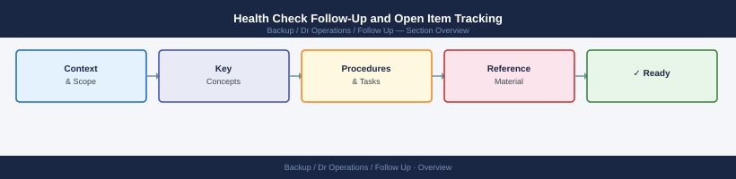

---
tags:
  - dr
---
# Health Check Follow-Up and Open Item Tracking

Health Check Follow-Up and Open Item Tracking reference covering Overview, Finding Classification, Creating Follow-Up Tickets, Owner Assignment, Tracking and Reporting and 1 more sections.

## Overview

Health check findings only have value if they are tracked to resolution. A finding that goes into a log and is never revisited is worse than useless — it creates a false sense that problems are being managed. This page covers how to turn health check output into tracked work items with owners and deadlines.

---

## Finding Classification

Not every finding requires the same urgency of response.

| Severity  | Criteria                                              | Response SLA     |
|-----------|-------------------------------------------------------|------------------|
| Critical  | Active or imminent service impact                     | Immediate        |
| High      | Risk of impact within 24–48 hours if unresolved       | Same business day|
| Medium    | Risk of impact within 7 days; no immediate danger     | Within 3 days    |
| Low       | Informational; best practice gap; no near-term risk   | Within 2 weeks   |

Apply severity at the time of finding, not after investigation is complete. Downgrade if investigation reveals lower risk; never leave it unclassified.

---

## Creating Follow-Up Tickets

For every finding above Low severity, raise a ticket immediately.

- [ ] Ticket title describes the finding clearly (not just "disk issue")
- [ ] Description includes: what was found, when, which system, current value vs threshold
- [ ] Evidence attached (screenshot, command output, log extract)
- [ ] Severity and priority set correctly
- [ ] Assigned to a named individual — not a team queue without an individual assigned
- [ ] Due date set per the SLA above
- [ ] Linked to the health check log entry that surfaced the finding

For Low severity findings, a comment in the daily check log is sufficient, but review them weekly to ensure none are aging unresolved.

---

## Owner Assignment

| Scenario                                      | Assign To                           |
|-----------------------------------------------|-------------------------------------|
| Single system, clear technical owner          | That owner directly                 |
| Shared infrastructure (e.g., network, storage)| On-call lead or infra lead          |
| Third-party or vendor-managed system          | Vendor management contact           |
| No obvious owner                              | Health check lead; escalate to manager |

An unassigned ticket is an unresolved finding. Chase assignment within 1 hour for Critical/High items.

---

## Tracking and Reporting

Maintain a live open-item register for all health check findings.

- Review the open-item register at every daily standup
- Escalate any item that misses its SLA to the team lead or manager
- Close items only when the fix is confirmed in production, not when the ticket is updated

| Field             | Description                                  |
|-------------------|----------------------------------------------|
| ID                | Ticket reference                             |
| Finding           | Short description                            |
| System            | Affected CI or service                       |
| Severity          | Critical / High / Medium / Low               |
| Owner             | Named individual                             |
| Due Date          | Per SLA from finding date                    |
| Status            | Open / In Progress / Resolved / Verified     |
| Verified Date     | Date fix confirmed in production             |

---

## Closure Criteria

A finding is only closed when:

- [ ] Root cause identified and documented in the ticket
- [ ] Fix implemented in production (or risk formally accepted with a date for future resolution)
- [ ] Post-fix validation completed (re-run the check that found the issue)
- [ ] CMDB or runbook updated if the finding revealed a gap in documentation
- [ ] Closure confirmed by the person who raised the finding, not just the person who fixed it

## See also

- [Health Checks](../index.md)
- [DR Runbooks](../../runbooks/index.md)
- [Recovery Testing](../../recovery-testing/index.md)
