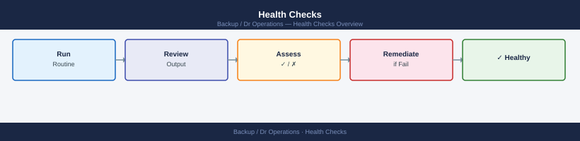

---
tags:
  - dr
---
# Health Checks

DR health-check hub: daily, pre-change, post-change, and evidence-collection routines covering RPO compliance, backup job status, and replication lag thresholds.

## Run This Routine

Run these steps as the standard project management health check sequence — before any change window, after any incident, and at each scheduled review.

1. **Daily checks first** — Open the [Daily Checks](daily-checks/) page and work through every line item. Confirm all indicators are green before proceeding. Log any amber or red items as follow-up actions.
2. **Open change review** — Verify all in-flight changes have an approved ticket and an assigned owner. Confirm no change is past its scheduled end time without a status update.
3. **Incident and risk log review** — Confirm no open P1/P2 incidents are linked to this project. Review the risk register for items that have become active; escalate anything newly triggered.
4. **Pre-change readiness (if applicable)** — If a change is scheduled, open [Pre Change](pre-change/) and complete all readiness checks: rollback plan confirmed, communication sent, maintenance window open.
5. **Post-change validation (if applicable)** — After a change completes, open [Post Change](post-change/) and run all validation steps. Capture evidence in [Evidence](evidence/) before closing the change ticket.
6. **Follow-up action review** — Open [Follow Up](follow-up/) and confirm all outstanding actions have owners and due dates. Escalate any overdue items.
7. **Record and sign off** — Log the date, checks performed, issues found, and actions taken. Confirm the next check-due date is set in the team calendar.

<a class="kb-card" href="daily-checks/">
  <strong>Daily Checks</strong>
  Daily Checks notes, checks, references, and validation.
</a>

<a class="kb-card" href="pre-change/">
  <strong>Pre Change</strong>
  Pre Change notes, checks, references, and validation.
</a>

<a class="kb-card" href="post-change/">
  <strong>Post Change</strong>
  Post Change notes, checks, references, and validation.
</a>

<a class="kb-card" href="evidence/">
  <strong>Evidence</strong>
  Evidence notes, checks, references, and validation.
</a>

<a class="kb-card" href="follow-up/">
  <strong>Follow Up</strong>
  Follow Up notes, checks, references, and validation.
</a>

