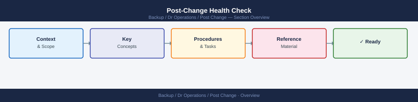

---
tags:
  - dr
---
# Post-Change Health Check


<div class="kb-summary">
Post-Change Health Check reference covering Overview, Timing, Post-Change Check Sequence, Comparison Against Pre-Change Baseline, Escalation During Post-Check and 1 more sections.
</div>



```d2
direction: right

center: "DR Operations" {shape: hexagon}
timing: "Timing" {shape: rectangle}
postchange_check_sequence: "Post-Change Check Sequence" {shape: rectangle}
comparison_against_prechange_baselin: "Comparison Against Pre-Change Baseline" {shape: rectangle}
escalation_during_postcheck: "Escalation During Post-Check" {shape: rectangle}
postcheck_signoff: "Post-Check Sign-Off" {shape: rectangle}

center -> timing
center -> postchange_check_sequence
center -> comparison_against_prechange_baselin
center -> escalation_during_postcheck
center -> postcheck_signoff
```

## Overview

A post-change health check is a structured review of system state immediately after a change is implemented. It is narrower and more targeted than a general daily check — the focus is on confirming the changed component is healthy and that nothing adjacent was disturbed. The rollback window remains open until this check passes.

---

## Timing

| Change Risk Level | When to Run Post-Check   | Rollback Window Duration |
|-------------------|--------------------------|--------------------------|
| Low               | Immediately after change | 30 minutes               |
| Medium            | Immediately + 1 hour     | 2 hours                  |
| High              | Immediately + 4 hours    | 24 hours                 |
| Critical          | Immediately + 24 hours   | 48–72 hours              |

Do not close the change ticket until the initial post-check is complete and passing.

---

## Post-Change Check Sequence

Run checks in this order. Stop and initiate backout if any step fails before moving to the next.

- [ ] **Service health** — confirm the directly changed service reports healthy
- [ ] **Application logs** — scan for new error patterns introduced by the change
- [ ] **Key functional test** — exercise the specific function that was changed
- [ ] **Monitoring alerts** — confirm no new alerts have fired since implementation
- [ ] **Upstream dependencies** — confirm services that feed the changed component are unaffected
- [ ] **Downstream dependencies** — confirm services consuming the changed component are unaffected
- [ ] **Performance baseline** — compare error rate, latency, and throughput against pre-change snapshot

---

## Comparison Against Pre-Change Baseline

Before starting the change, snapshot these values and record them in the change ticket.

| Metric               | Pre-Change Value | Post-Change Value | Within Normal Range? |
|----------------------|------------------|-------------------|----------------------|
| Service error rate   |                  |                   |                      |
| Response time (p95)  |                  |                   |                      |
| CPU utilisation      |                  |                   |                      |
| Memory utilisation   |                  |                   |                      |
| Active connections   |                  |                   |                      |

Fill in the Post-Change Value column immediately after implementation. Any column showing "No" is a potential rollback trigger.

---

## Escalation During Post-Check

If the post-change check reveals a problem:

1. Do not close the change ticket or dismiss the change bridge
2. Assess whether it meets backout criteria (defined in the backout plan)
3. If backout criteria are met, initiate backout immediately
4. If uncertain, escalate to the change owner before deciding to proceed
5. Raise an incident ticket if the issue is causing or will likely cause user impact
6. Do not exceed the rollback window without a conscious decision and documented justification

---

## Post-Check Sign-Off

- [ ] All post-change checks completed and results documented in the change ticket
- [ ] Monitoring observation period confirmed and owner named
- [ ] Any anomalies investigated and either resolved or risk-accepted in writing
- [ ] Rollback window expiry time noted in the ticket
- [ ] Change owner notified of post-check completion status

## See also

- [Health Checks](../index.md)
- [Pre-Change Checks](../pre-change/index.md)
- [Daily Checks](../daily-checks/index.md)
- [DR Runbooks](../../runbooks/index.md)
