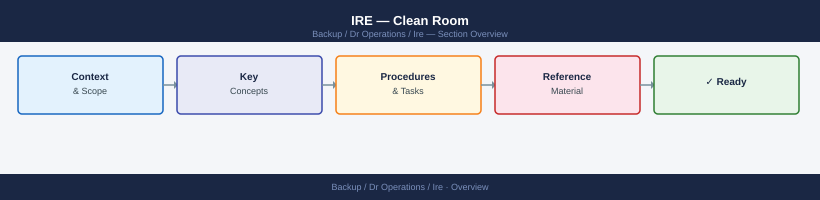
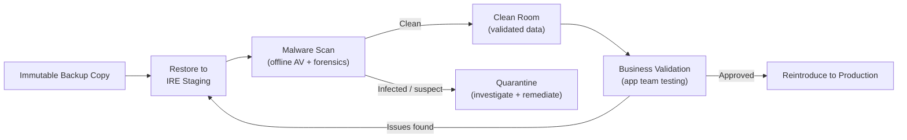

---
tags:
  - dr
---
# IRE — Clean Room

The clean room is a verified, malware-free subset of the IRE used to analyse and validate recovered data before reintroducing it to production. Verify that backups fall within the defined retention window (30–90 days) before restoration. Nothing leaves the clean room until it has been scanned and validated.

## Purpose

After restoring a backup to the IRE, the restored data may still contain:
- Dormant ransomware or malware executables.
- Corrupted data files from the attack period.
- Encrypted files that appear intact but are inaccessible.

The clean room is where analysis occurs. Data and systems are treated as suspect until proven clean.

## Clean Room Architecture

## Common Issues

| Symptom | Cause | Resolution |
|---|---|---|
| AV scan misses malware | Signature definitions outdated | Update definitions from offline mirror before each scan cycle |
| Recovered database won't start | Binary files corrupted or OS config mismatch | Check error logs; try restore from an earlier backup point |
| Clean room has internet access | Firewall misconfiguration | Block all outbound from clean room subnet except to IR team jump host |
| App team needs prod-like config to test | Config files contain prod secrets | Substitute test credentials; never bring prod credentials into IRE |
