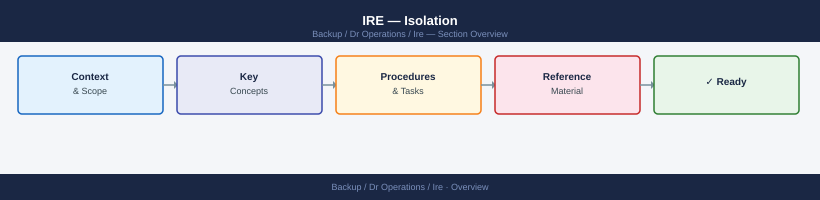
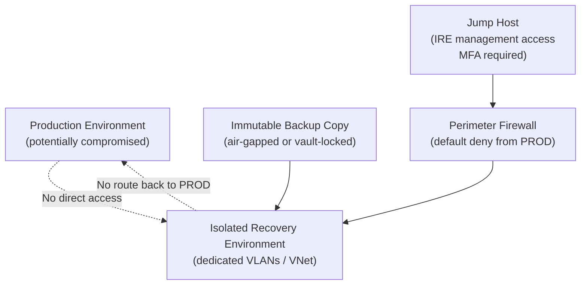

---
tags:
  - dr
---
# IRE — Isolation


<div class="kb-summary">
The Isolated Recovery Environment (IRE) is a network-isolated, air-gapped environment used for recovering from ransomware and other destructive attacks. Network isolation must be established before any backup retrieval or restore operations; confirm daily that all air-gap controls are active when the IRE is in standby.
</div>



 Isolation is the foundational control: the IRE must never share network paths, credentials, or management planes with the production environment.

```d2
direction: right

center: "DR Operations" {shape: hexagon}
why_isolation_matters: "Why Isolation Matters" {shape: rectangle}
network_isolation_architecture: "Network Isolation Architecture" {shape: rectangle}
isolation_verification_checklist: "Isolation Verification Checklist" {shape: rectangle}
common_issues: "Common Issues" {shape: rectangle}

center -> why_isolation_matters
center -> network_isolation_architecture
center -> isolation_verification_checklist
center -> common_issues
```

## Why Isolation Matters

Ransomware that has compromised a production environment may still be active during a recovery attempt. If the IRE shares any network connectivity with production, the threat actor can:
- Detect and destroy clean recovery copies.
- Pivot from production into the IRE.
- Re-encrypt or corrupt systems being restored.

Isolation eliminates these lateral movement paths.

## Network Isolation Architecture




## Isolation Verification Checklist

| Check | Command / Test | Pass condition |
|---|---|---|
| No network route from IRE to production | `traceroute <prod-host>` from IRE | Route fails or hits default deny |
| No route from production to IRE | `ping <ire-host>` from prod | No response |
| No shared AD | `nltest /dsgetdc:<prod-domain>` from IRE | Returns error |
| No shared credentials | Verify IRE accounts do not exist in prod AD | Enumeration returns nothing |
| Immutable backups | Check immutability lock state | Locked, cannot be deleted |
| Firewall ACL | Review firewall ruleset | Default deny between prod and IRE |

## Common Issues

| Symptom | Cause | Resolution |
|---|---|---|
| IRE VM can ping production host | Missing ACL or VLAN trunk leak | Check firewall ACLs and switch port VLAN configuration |
| Restore fails because backup store is unreachable | Backup store IP not whitelisted in IRE firewall | Add firewall rule: IRE → backup store IP, port 443 only |
| Cannot manage IRE systems remotely | Jump host not in allowed source list | Update IRE NSG/firewall to allow traffic from jump host subnet only |
| AD join required for IRE workloads | App requires domain membership | Build dedicated IRE domain; never join production domain |
