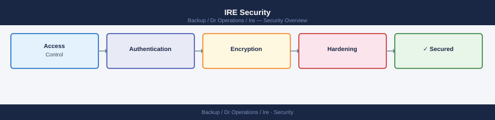

---
tags:
  - dr
  - security
---
# IRE Security

<div class="kb-summary">
IRE security controls: enforce two-person integrity for all vault access, use IRE-exclusive credentials that expire after each recovery event, enable full audit logging of all sessions in the IRE, and verify that backup retention copies in the vault are immutable and cannot be modified by compromised accounts.

*Applies to: IRE (Isolated Recovery Environment)*
</div>



```powershell
# Verify IRE local admin accounts are not shared with production
$prodAdmins = (Invoke-Command -ComputerName prod-dc01 { Get-ADGroupMember Administrators }).Name
$ireAdmins  = (Invoke-Command -ComputerName ire-dc01  { Get-ADGroupMember Administrators }).Name
Compare-Object $prodAdmins $ireAdmins -IncludeEqual | Where-Object {$_.SideIndicator -eq "=="}
# Should return empty — no overlapping accounts
```

```bash
# Syslog forwarding to isolated log server (IRE-internal only)
# /etc/rsyslog.d/ire-audit.conf
*.* @@10.200.254.10:514   # IRE syslog server — no route to production

# Azure: route IRE activity logs to separate Log Analytics workspace
az monitor diagnostic-settings create \
  --resource /subscriptions/<ire-sub-id>/resourceGroups/ire-rg \
  --name "ire-audit" \
  --workspace <ire-log-analytics-workspace-id> \
  --logs '[{"category":"Administrative","enabled":true},{"category":"Security","enabled":true}]'
```
```bash
# Azure: deallocate and delete IRE VMs after sign-off
az vm list --resource-group ire-rg --output table
az vm delete --resource-group ire-rg --name <ire-vm> --yes --no-wait

# Rotate break-glass account passwords
$newPass = [System.Web.Security.Membership]::GeneratePassword(32, 6)
Set-ADAccountPassword -Identity ire-breakglass -NewPassword (ConvertTo-SecureString $newPass -AsPlainText -Force)
# Print and seal in envelope — never store in digital form
```

## Before you begin

- **Access:** Backup admin role on backup server; target system credentials
- **Change management:** security changes require CAB approval in most environments
- **Rollback plan:** document current state before any security control change
- **Testing:** validate in a non-production environment first where possible

---

