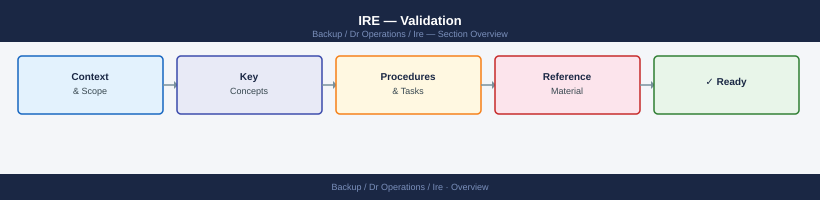
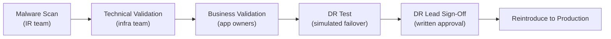

---
tags:
  - dr
---
# IRE — Validation


<div class="kb-summary">
Validation is the final gate before restored systems return to production. It covers technical verification (application health, data integrity) and business verification (data completeness, schedule compliance, and retention window confirmation — verify the restored data point is within the approved retention period and predates the compromise eventunctionality).
</div>



```d2
direction: right

center: "DR Operations" {shape: hexagon}
validation_gates: "Validation Gates" {shape: rectangle}
rto_rpo_measurement: "RTO / RPO Measurement" {shape: rectangle}
common_issues: "Common Issues" {shape: rectangle}

center -> validation_gates
center -> rto_rpo_measurement
center -> common_issues
```

## Validation Gates




## RTO / RPO Measurement

Record actual recovery metrics for post-incident review:

| Metric | Definition | Measured value |
|---|---|---|
| **RTO** | Time from IRE activation to production-ready | ___ hours |
| **RPO** | Age of data at the chosen recovery point | ___ hours |
| **MTTR** | Total time from incident declaration to production recovery | ___ hours |
| **Scan duration** | Time taken for malware scan of all recovered volumes | ___ hours |
| **Restore duration** | Time taken to restore all systems to IRE | ___ hours |

```bash
# Log timestamps throughout the process
echo "$(date -u '+%Y-%m-%dT%H:%M:%SZ') IRE activation declared" >> /var/log/ire-timeline.log
echo "$(date -u '+%Y-%m-%dT%H:%M:%SZ') Backup retrieval complete" >> /var/log/ire-timeline.log
echo "$(date -u '+%Y-%m-%dT%H:%M:%SZ') Restore to IRE complete" >> /var/log/ire-timeline.log
echo "$(date -u '+%Y-%m-%dT%H:%M:%SZ') Malware scan complete — clean" >> /var/log/ire-timeline.log
echo "$(date -u '+%Y-%m-%dT%H:%M:%SZ') Business validation complete" >> /var/log/ire-timeline.log
echo "$(date -u '+%Y-%m-%dT%H:%M:%SZ') Production cutover complete" >> /var/log/ire-timeline.log
```

## Common Issues

| Symptom | Cause | Resolution |
|---|---|---|
| App health check passes but business test fails | App started but connected to wrong (production) database endpoint | Verify DB connection string in IRE config points to IRE DB |
| Data appears complete but timestamps are wrong | Timezone mismatch between IRE and production | Verify NTP source in IRE is IRE-internal; adjust display timezone |
| Business owner cannot access IRE clean room | IRE account not pre-provisioned | Create app-team accounts in IRE IdP before the next test or incident |
| Validation takes longer than RTO allows | Too many manual test scenarios | Pre-automate key validation scripts; reduce scenario list to critical paths |
| DB row count lower than expected | Recovery point predates recent data load | Either accept data loss or select a later recovery point and re-scan |
