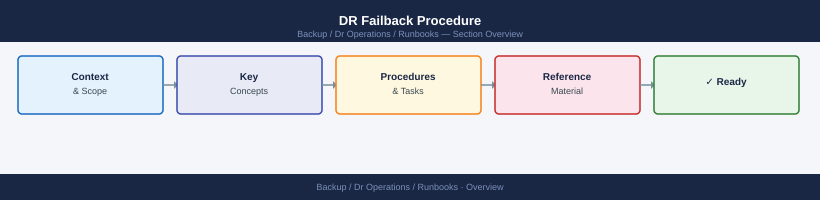

---
tags:
  - dr
---
# DR Failback Procedure

<div class="kb-summary">
DR failback procedure: confirm production site healthy, reverse-resync storage replication, redirect hosts back to production, restore daily and weekly backup schedules on production, and validate that retention-compliant backups exist before decommissioning DR workloads.

*Applies to: all products with DR replication*
</div>



```bash
# Confirm primary storage arrays healthy
# ONTAP
system health status show
storage disk show -broken

# Pure FlashArray
purecli array get
purecli drive list | grep -v healthy

# Confirm primary SAN fabric healthy
show interface fc brief           # Cisco MDS
switchshow                        # Brocade
```

```bash
# ONTAP — confirm lag is zero before breaking
snapmirror show -destination-path <primary-svm>:<primary-vol> -fields lag-time
# lag-time should be 00:00:00 or very small

# Break mirror — primary volume becomes writable
snapmirror break -destination-path <primary-svm>:<primary-vol>
```
```powershell
# Shut down VM at DR
Stop-VM -VM "<vm-name>" -Confirm:$false

# Power on at primary (VM should already be registered from original config)
Start-VM -VM "<vm-name>" -Server <primary-vcenter>
```
```bash
# Storage visible at primary hosts
multipath -ll
lsblk
df -h

# Application services
systemctl start <service>
systemctl status <service>

# Application health
curl -vk https://<primary-app-url>/health
```
```bash
# PostgreSQL
psql -U <user> -c "SELECT pg_database_size('<db>');"

# MSSQL (PowerShell)
Invoke-Sqlcmd -Query "DBCC CHECKDB('<db>') WITH NO_INFOMSGS" -ServerInstance <primary-sql>
```
```bash
# ONTAP — resync back to original direction
snapmirror resync -source-path <primary-svm>:<primary-vol> -destination-path <dr-svm>:<dr-vol>

# Confirm
snapmirror show -destination-path <dr-svm>:<dr-vol>
```

## See also

- [DR Runbooks](../index.md)
- [Failover](../failover/index.md)
- [Full DR Runbook](../dr-runbook/index.md)
- [DR Design](../../dr-design/index.md)
- [Recovery Testing](../../recovery-testing/index.md)
