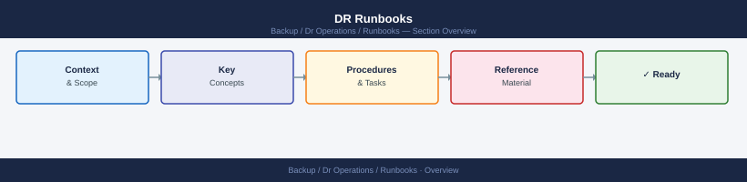

---
tags:
  - dr
---
# DR Runbooks

Step-by-step DR runbooks for failover, failback, and full DR activation. Each runbook includes activation criteria, backup schedule verification, pre-checks, phased procedures, communication trees, and validation checklists. Verify that retention-compliant backups exist before committing to failover or failback.

<a class="kb-card" href="dr-runbook/">
  <strong>DR Activation Runbook</strong>
  Full DR site activation — criteria, communication tree, phased recovery, and sign-off checklist.
</a>

<a class="kb-card" href="failover/">
  <strong>Failover Procedure</strong>
  Step-by-step failover to DR site — storage, compute, and network cutover sequence.
</a>

<a class="kb-card" href="failback/">
  <strong>Failback Procedure</strong>
  Return operations to production site after DR event — re-sync, validation, and cutback steps.
</a>

