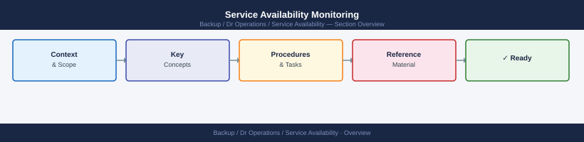

---
tags:
  - dr
---
# Service Availability Monitoring


<div class="kb-summary">
Service Availability Monitoring reference covering Availability Calculation, Uptime Monitoring Tools, Azure Monitor — Availability Test, AWS Route 53 Health Checks, Availability Incident Tracking and 1 more sections.
</div>



## Availability Calculation


## AWS Route 53 Health Checks

```bash
# Create HTTP health check
aws route53 create-health-check \
  --caller-reference "$(date +%s)" \
  --health-check-config '{
    "Type": "HTTPS",
    "FullyQualifiedDomainName": "<app-host>",
    "Port": 443,
    "ResourcePath": "/health",
    "RequestInterval": 30,
    "FailureThreshold": 3
  }'

# Get health check status
aws route53 get-health-check-status --health-check-id <id> \
  --query 'HealthCheckObservations[*].{Region:Region,Status:StatusReport.Status}'
```

## Availability Incident Tracking

```markdown
Incident:       APP-2026-042
Service:        ERP Application
Start time:     2026-05-05 14:23 UTC
End time:       2026-05-05 15:07 UTC
Downtime:       44 minutes
SLO impact:     Monthly budget: 43.8 min — budget consumed 100%
Root cause:     Database connection pool exhausted due to slow query
Detection:      Monitoring alert fired at 14:24 (1 min after start)
Resolution:     Restarted connection pool; fixed query index
```

## Reporting

| Report | Frequency | Audience |
|---|---|---|
| Availability dashboard | Real-time | Operations team |
| Monthly SLO compliance | Monthly | Management, service owners |
| Incident post-mortem | After each P1/P2 | Management, tech leads |
| Quarterly availability trend | Quarterly | CISO, IT management |
