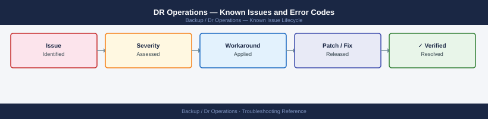

---
tags:
  - troubleshooting
  - dr-operations
  - backup
  - known-issues
---
# DR Operations — Known Issues and Error Codes

<div class="kb-summary">
Catalog of known issues in DR runbook operations covering failover testing, network re-IP, DNS cutover, and application restart sequencing.

*Applies to: DR operations across all platforms*
</div>



```d2
direction: down

symptom: Identify Symptom {shape: diamond}
failover_testing: "Failover Testing" {shape: rectangle}
network_reip: "Network Re-IP" {shape: rectangle}
storage: "Storage" {shape: rectangle}
resolution: Resolve or Escalate {shape: oval}

symptom -> failover_testing: investigate
symptom -> network_reip: investigate
symptom -> storage: investigate
failover_testing -> resolution
network_reip -> resolution
storage -> resolution
```

## Before you begin

- DR test failures are almost always sequencing or network issues, not storage failures.
- Always verify: DNS cutover, network re-IP, application dependency order, and authentication (AD/LDAP) at DR site before declaring DR success.

## Failover Testing

| Error / Symptom | Cause | Workaround / Fix |
|---|---|---|
| Application accessible but returning stale data | Test failover using isolated network; production data not replicated to test environment | Use production replicas for tests; or create a dedicated DR test environment with data clone |
| DNS not resolving DR site FQDNs | DNS delegation to DR site DNS not configured | Pre-configure DR DNS servers with all application FQDNs before DR test |
| AD authentication failing at DR site | AD DCs at DR site not reachable or not promoted | Ensure at least one writable DC is at DR site; test AD replication health before failover |
| Applications start in wrong order (dependency failures) | Runbook sequence incorrect | Document and test startup sequence: DB → middleware → app → load balancer |

## Network Re-IP

| Error / Symptom | Cause | Workaround / Fix |
|---|---|---|
| Servers have same IP at DR as production (IP conflict) | DR network is a copy of production; L2 extension used | Use L3 re-IP at DR site; or L2 extension with appropriate isolation |
| Load balancer VIPs not responding at DR | VIP not migrated or physical LB not configured at DR | Configure DR load balancer VIPs in advance; test via DR network before production failover |

## Storage

| Error / Symptom | Cause | Workaround / Fix |
|---|---|---|
| DR VM starts but filesystem read-only | Replication-based copy has filesystem journal in unclean state | Mount with recovery: `mount -o remount,rw /dev/<device>` (Linux) or run `chkdsk` (Windows) |

## See also

- [Veeam — Known Issues](../../products/veeam/troubleshooting/known-issues.md)
- [VMware SRM — Known Issues](../../../virtualization/vmware/srm/troubleshooting/known-issues.md)
