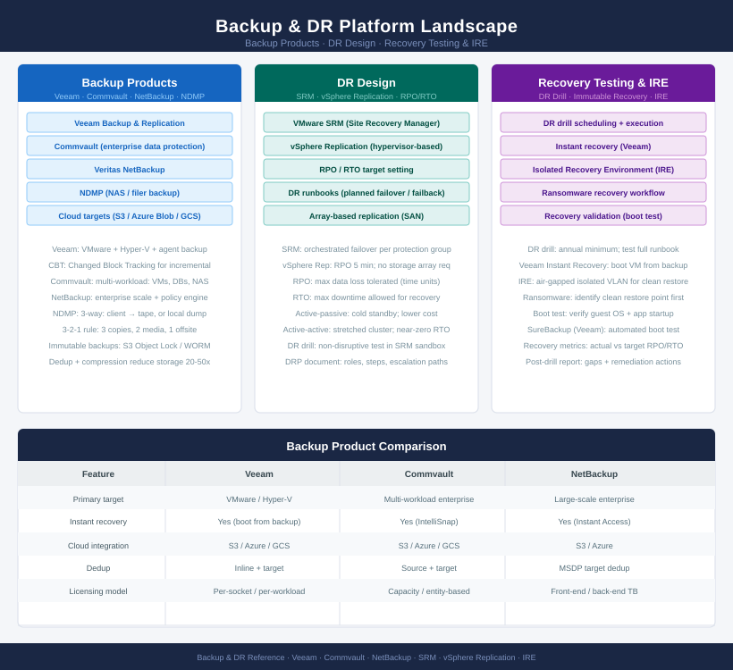
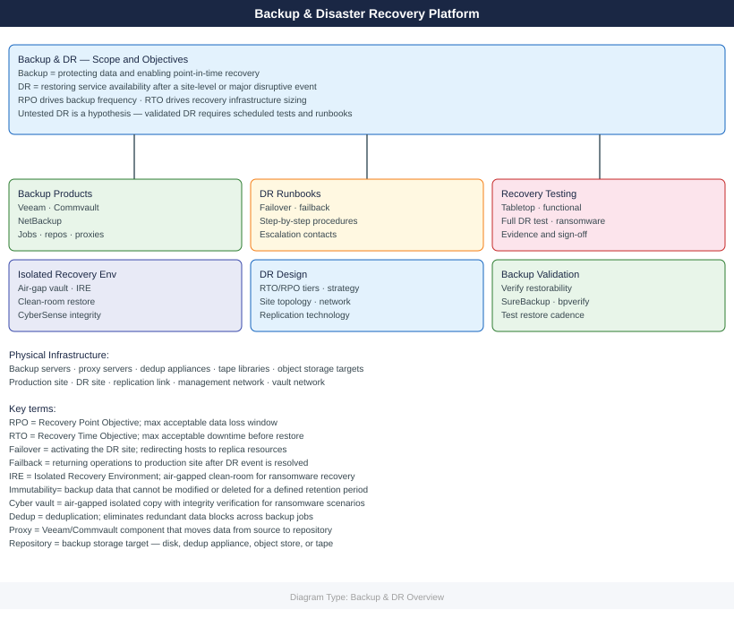

# Backup & DR

<div class="kb-summary">
Enterprise backup and disaster recovery — Veeam, Commvault, and NetBackup backup products, plus DR design, runbooks, recovery testing, Isolated Recovery Environment (IRE), backup validation, and health checks.
</div>





```d2
direction: right

center: "Backup" {shape: hexagon}
backup_products: "Backup Products" {shape: rectangle}
disaster_recovery: "Disaster Recovery" {shape: rectangle}

center -> backup_products
center -> disaster_recovery
```

## Backup Products

<div class="kb-grid kb-grid-3">

<a class="kb-card" href="veeam/">
  <strong>Veeam</strong>
  <span>VM and physical backup, replication, instant recovery, and Veeam ONE monitoring.</span>
</a>

<a class="kb-card" href="commvault/">
  <strong>Commvault</strong>
  <span>Enterprise data platform — backup, archive, compliance, and cloud integration.</span>
</a>

<a class="kb-card" href="netbackup/">
  <strong>NetBackup</strong>
  <span>Enterprise backup for VMs, physical servers, databases, and tape infrastructure.</span>
</a>

</div>

## Disaster Recovery

<div class="kb-grid kb-grid-1">

<a class="kb-card" href="dr-operations/">
  <strong>DR Operations</strong>
  <span>DR design, runbooks, recovery testing, IRE, backup validation, health checks, failure testing, SLOs, service availability, and troubleshooting.</span>
</a>

</div>
