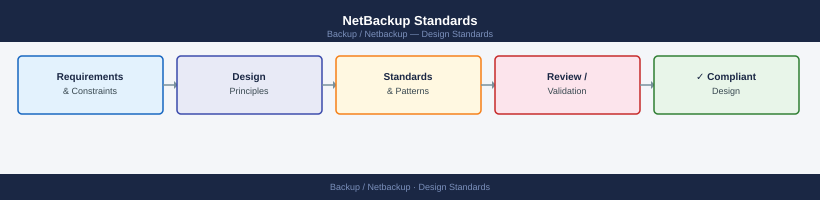

---
tags:
  - architecture
  - netbackup
---
# NetBackup Standards

NetBackup Standards reference covering Naming Conventions, Retention Schedule, Backup Policy to Job Flow, Encryption Standard, Test Restore Standard.

*Applies to: NetBackup 10.x*

## Naming Conventions

| Object | Convention | Example |
|---|---|---|
| Policy | `<app>-<os>-<frequency>` | `oracle-linux-daily`, `mssql-win-weekly` |
| Schedule | `<type>-<retention>` | `full-14d`, `incr-7d`, `weekly-8w` |
| Storage Unit | `<site>-<type>-<tier>` | `dc1-ostdd-primary`, `dc2-cloud-archive` |
| Media Server | `<site>-nbumedia-<seq>` | `dc1-nbumedia-01` |
| Client Group | `<env>-<os>-<tier>` | `prod-linux-db`, `prod-windows-app` |

## Retention Schedule

| Level | Schedule Type | Retention |
|---|---|---|
| Daily | Incremental | 14 days |
| Weekly | Full | 8 weeks |
| Monthly | Full | 12 months |
| Yearly | Full | 7 years |

Compliance requirements may extend yearly retention to 10 years for regulated data.

## Backup Policy to Job Flow

## Encryption Standard

| Data Classification | Policy | Algorithm |
|---|---|---|
| PII / Regulated | Mandatory | AES-256 |
| Business-sensitive | Required | AES-256 |
| Internal | Optional | N/A |

Key management: store encryption key files in CyberArk or an offline vault. Loss of key = unrecoverable backup data.

## Test Restore Standard

| Restore Type | Frequency |
|---|---|
| File-level restore test (non-critical VM) | Monthly |
| Full VM restore test | Quarterly |
| Database restore test (Oracle/MSSQL) | Quarterly |
| Catalog recovery test | Annually |

---

## See also

- [Netbackup — Deploy](../../deploy/)
