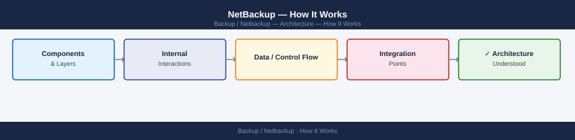
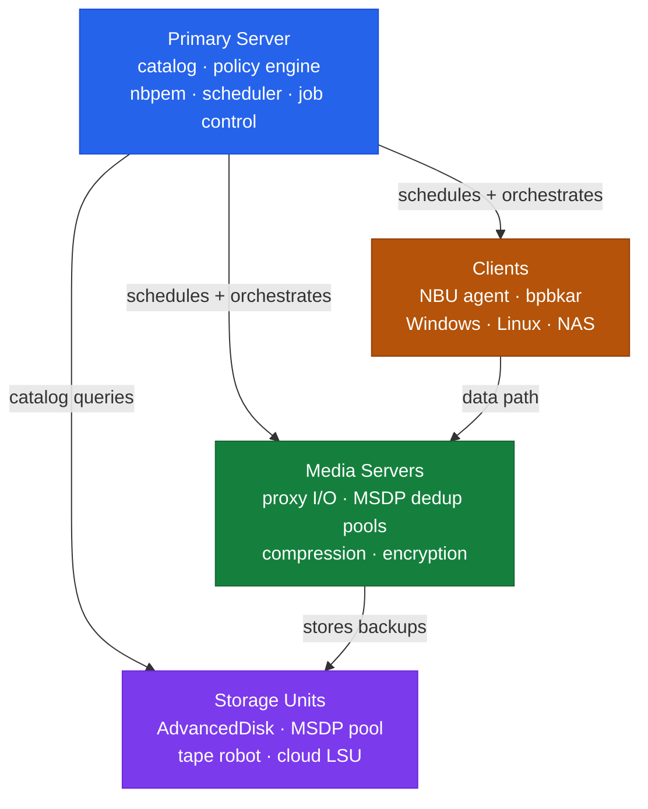

---
tags:
  - architecture
  - netbackup
---
# NetBackup — How It Works

How It Works reference covering Overview, Three-Tier Topology, Domain Sizing Guidelines.

*Applies to: NetBackup 10.x*

## Overview

NetBackup operates on a three-tier architecture: a centralized Primary Server (formerly Master Server) coordinates all operations via policy scheduling, catalog management, and resource arbitration. Media Servers handle data movement — reading from clients and writing to storage units. The Catalog is the operational heartbeat of the entire deployment, storing all image metadata, policies, and media inventory.

## Three-Tier Topology

Store the DR file off-host (NAS/object storage) and the passphrase in a secure vault — both are required for catalog recovery.

## Domain Sizing Guidelines

| Environment Scale | Primary Server vCPU | RAM | Catalog Disk |
|---|---|---|---|
| Small (<500 clients) | 8 vCPU | 32 GB | 500 GB |
| Medium (500–2000 clients) | 16 vCPU | 64 GB | 2 TB |
| Large (>2000 clients) | 32 vCPU | 128 GB | 5–10 TB |

Catalog disk should be on SSD/NVMe — IOPS under load are significantly higher than sequential throughput figures suggest.

---

## See also

- [Netbackup — Design Standards](../design-standards/)
- [Netbackup — Integrations](../integrations/)
- [Netbackup — Deploy](../../deploy/)
