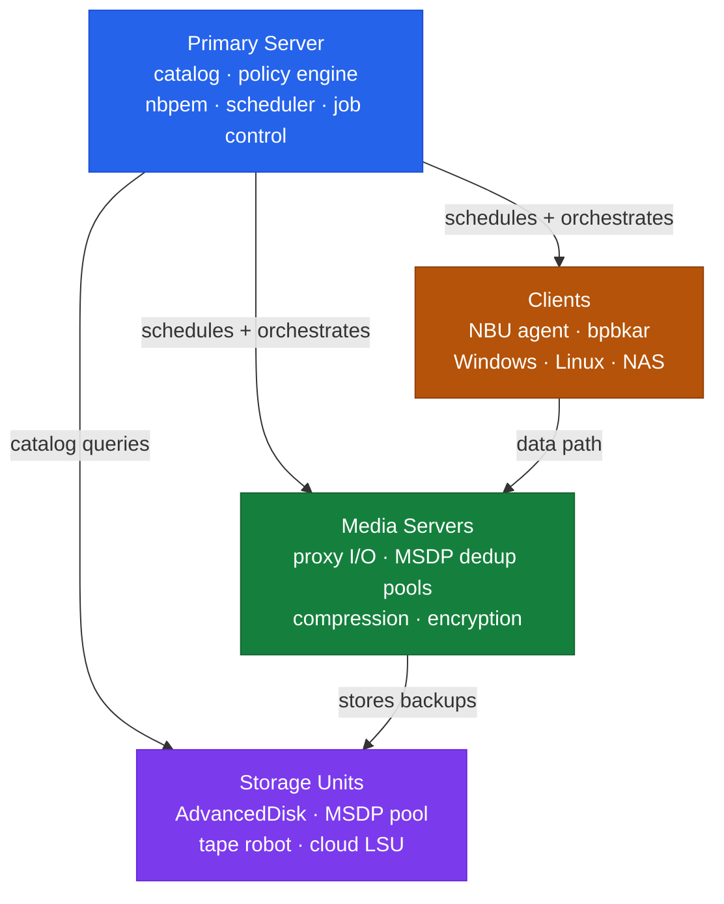

---
tags:
  - architecture
  - netbackup
---
# NetBackup — How It Works


<div class="kb-summary">
How It Works reference covering Overview, Three-Tier Topology, Domain Sizing Guidelines.

*Applies to: NetBackup 10.x*
</div>

```text
┌────────────────────────────────────── NetBackup — How It Works ───────────────────────────────────────┐
│                                                                                                       │
│    NetBackup data flow — from source to target through the protection pipeline:                       │
│                                                                                                       │
│   ┌───────────────────────────────────────────────────────────────────────────────────────────────┐   │
│   │                                 1  Source / Production System                                 │   │
│   │               Master Server     — scheduler, catalog, policy engine, job controller           │   │
│   │              Host writes are intercepted or snapshotted by the NetBackup agent/proxy          │   │
│   │                  Changed blocks tracked via CBT / journal / delta-set mechanism               │   │
│   │                 Consistency ensured at quiesce point before data transfer begins              │   │
│   └───────────────────────────────────────────────────────────────────────────────────────────────┘   │
│                                                                                                       │
│    Changed data forwarded to the NetBackup engine — compression and encryption applied in transit     │
│                                                                                                       │
│                                                   ▼                                                   │
│                                                                                                       │
│   ┌───────────────────────────────────────────────────────────────────────────────────────────────┐   │
│   │                                      2  NetBackup Engine                                      │   │
│   │               Media Server      — data mover, dedup engine, storage unit management           │   │
│   │                    Data compressed, deduplicated, and encrypted before storage                │   │
│   │                  Metadata catalog updated; job status reported to control plane               │   │
│   │                                       bpbackup / bprestore                                    │   │
│   └───────────────────────────────────────────────────────────────────────────────────────────────┘   │
│                                                                                                       │
│                                                   ▼                                                   │
│                                                                                                       │
│   ┌───────────────────────────────────────────────────────────────────────────────────────────────┐   │
│   │                                     3  Target / Repository                                    │   │
│   │            Client Agent      — installed on protected host; sends data to media server        │   │
│   │                  Recovery point written; retention policy applied automatically               │   │
│   │                                    Restore: bplist / bpdbjobs                                 │   │
│   │                     RTO driven by target storage performance and data volume                  │   │
│   └───────────────────────────────────────────────────────────────────────────────────────────────┘   │
│                                                                                                       │
│  Physical Infrastructure:                                                                             │
│  Linux/Windows rack servers · SAN HBAs for tape · 10 GbE NIC · SCSI tape robot connection             │
│  Key terms:                                                                                           │
│                                                                                                       │
│  Master Server = central controller: scheduler, catalog, job manager, policy engine                   │
│  Media Server  = data mover between client and storage; can be co-located with master                 │
│  MSDP          = Media Server Deduplication Pool; inline variable-length block dedup                  │
│  Storage Unit  = logical target: AdvancedDisk, MSDP pool, cloud LSU, or tape robot                    │
│  Policy        = defines what, when, and where to back up; contains schedules and clients             │
│  Schedule      = full / differential-incremental / cumulative-incremental timing within policy        │
│  Retention     = how long an image is kept; set per schedule, enforced by catalog expiry              │
│  Catalog       = internal PostgreSQL DB tracking all image metadata, host IDs, and config             │
│  NBU CA        = auto-issued certificate authority; signs host IDs for secure comms                   │
│  vnetd         = NetBackup network daemon; multiplexes all client-master-media on port 1556           │
│  bpdbjobs      = CLI to query job history: status, duration, exit code, errors                        │
│  bplist        = CLI to list available backup images for a client, policy, or date range              │
│  KMS           = Key Management Service for encryption keys used in backup data encryption            │
│  NDMP          = Network Data Management Protocol; direct NAS-to-storage backup path                  │
│                                                                                                       │
└───────────────────────────────────────────────────────────────────────────────────────────────────────┘
```
## Overview

NetBackup operates on a three-tier architecture: a centralized Primary Server (formerly Master Server) coordinates all operations via policy scheduling, catalog management, and resource arbitration. Media Servers handle data movement — reading from clients and writing to storage units. The Catalog is the operational heartbeat of the entire deployment, storing all image metadata, policies, and media inventory.

## Three-Tier Topology



Store the DR file off-host (NAS/object storage) and the passphrase in a secure vault — both are required for catalog recovery.

## Domain Sizing Guidelines

| Environment Scale | Primary Server vCPU | RAM | Catalog Disk |
|---|---|---|---|
| Small (<500 clients) | 8 vCPU | 32 GB | 500 GB |
| Medium (500–2000 clients) | 16 vCPU | 64 GB | 2 TB |
| Large (>2000 clients) | 32 vCPU | 128 GB | 5–10 TB |

Catalog disk should be on SSD/NVMe — IOPS under load are significantly higher than sequential throughput figures suggest.

---

## See also

- [Netbackup — Design Standards](../design-standards/)
- [Netbackup — Integrations](../integrations/)
- [Netbackup — Deploy](../../deploy/)
