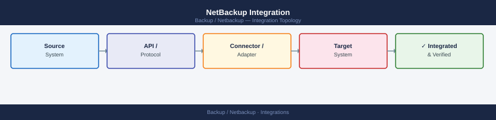

---
tags:
  - architecture
  - netbackup
---
# NetBackup Integration


<div class="kb-summary">
NetBackup Integration reference covering Integration Architecture, SIEM Integration, CyberArk Integration, OpsCenter / IT Analytics.

*Applies to: NetBackup 10.x*
</div>



```d2
direction: right

center: "NetBackup" {shape: hexagon}
integration_architecture: "Integration Architecture" {shape: rectangle}
cyberark_integration: "CyberArk Integration" {shape: rectangle}
opscenter_it_analytics: "OpsCenter / IT Analytics" {shape: rectangle}

center -> integration_architecture
center -> cyberark_integration
center -> opscenter_it_analytics
```

## Integration Architecture

```mermaid
flowchart TD
    master["NetBackup\nPrimary Server"]

    subgraph storageIntegrations [Storage Integrations]
        ostDD["Dell Data Domain\nOST / DD Boost\n(inline dedup)"]
        msdpPool["MSDP Pool\nMedia Server Dedup\n(native dedup)"]
        pureSnap["Pure FlashArray\nSnapshot Client\n(near-zero RPO)"]
        s3Cloud["AWS S3\nCloud Storage Unit\n(Glacier archival)"]
    end

    subgraph sourceIntegrations [Source / Client Integrations]
        vadp["VMware VADP\nbpvmutil — agentless VM backup"]
        cyberark["CyberArk AAM\nruntime credential retrieval"]
    end

    subgraph operationsIntegrations [Operations Integrations]
        opscenter["OpsCenter\ncentralised reporting + alerts"]
        siem["SIEM\nsyslog audit log forwarding"]
    end

    master --> ostDD
    master --> msdpPool
    master --> pureSnap
    master --> s3Cloud
    master --> vadp
    master --> cyberark
    master --> opscenter
    master --> siem

    classDef master fill:#2563eb,stroke:#1d4ed8,color:#fff
    classDef storage fill:#7c3aed,stroke:#6d28d9,color:#fff
    classDef source fill:#15803d,stroke:#166534,color:#fff
    classDef ops fill:#b45309,stroke:#92400e,color:#fff
    class master master
    class ostDD,msdpPool,pureSnap,s3Cloud storage
    class vadp,cyberark source
    class opscenter,siem ops
```




Alert on: `backup failed`, `policy modified`, `client deleted`, `catalog backup failed`.

## CyberArk Integration

NetBackup retrieves service account passwords from CyberArk at runtime:

1. Install CyberArk AAM (Application Access Manager) agent on master and media servers
2. Configure NetBackup to use CyberArk: Credentials → enable CyberArk CCP integration
3. Create application credential in CyberArk safe mapped to NetBackup service account

## OpsCenter / IT Analytics

Connect OpsCenter to the master server for centralised reporting:

```bash
# Verify master server is connected to OpsCenter
/opt/SYMCOpsCenterServer/bin/opscenteragent status
```

Key reports:
- Job success rate by policy
- Backup window utilisation
- Storage unit fill levels
- Client backup age (identify clients not backed up recently)

---

## See also

- [Netbackup — Design Standards](../design-standards/)
