---
tags:
  - architecture
  - netbackup
---
# NetBackup Integration


<div class="kb-summary">
NetBackup Integration reference covering Integration Architecture, SIEM Integration, CyberArk Integration, OpsCenter / IT Analytics.

*Applies to: NetBackup 10.x*
</div>

## Integration Architecture

```mermaid
flowchart TD
    master["NetBackup\nPrimary Server"]

    subgraph storageIntegrations [Storage Integrations]
        ostDD["Dell Data Domain\nOST / DD Boost\n(inline dedup)"]
        msdpPool["MSDP Pool\nMedia Server Dedup\n(native dedup)"]
        pureSnap["Pure FlashArray\nSnapshot Client\n(near-zero RPO)"]
        s3Cloud["AWS S3\nCloud Storage Unit\n(Glacier archival)"]
    end

    subgraph sourceIntegrations [Source / Client Integrations]
        vadp["VMware VADP\nbpvmutil — agentless VM backup"]
        cyberark["CyberArk AAM\nruntime credential retrieval"]
    end

    subgraph operationsIntegrations [Operations Integrations]
        opscenter["OpsCenter\ncentralised reporting + alerts"]
        siem["SIEM\nsyslog audit log forwarding"]
    end

    master --> ostDD
    master --> msdpPool
    master --> pureSnap
    master --> s3Cloud
    master --> vadp
    master --> cyberark
    master --> opscenter
    master --> siem

    classDef master fill:#2563eb,stroke:#1d4ed8,color:#fff
    classDef storage fill:#7c3aed,stroke:#6d28d9,color:#fff
    classDef source fill:#15803d,stroke:#166534,color:#fff
    classDef ops fill:#b45309,stroke:#92400e,color:#fff
    class master master
    class ostDD,msdpPool,pureSnap,s3Cloud storage
    class vadp,cyberark source
    class opscenter,siem ops
```


```text
┌──────────────────────────────── NetBackup — Architecture Integrations ────────────────────────────────┐
│                                                                                                       │
│   ┌───────────────────────────────────────────────────────────────────────────────────────────────┐   │
│   │                            NetBackup — External Integration Points                            │   │
│   │            Auth: NBU CA host-ID certificates; AD/LDAP for web UI login; RBAC roles            │   │
│   │                       Storage: connected via 443 (Web UI) · 1556 (vnetd)                      │   │
│   │            Monitoring: SNMP traps / syslog / REST API to ITSM and alerting systems            │   │
│   │      Encryption: AES-256 backup encryption; KMS key management; TLS 1.2+ on all channels      │   │
│   └───────────────────────────────────────────────────────────────────────────────────────────────┘   │
│                                                                                                       │
│                          ▼                        ▼                        ▼                          │
│                                                                                                       │
│   ┌─────────────────────────────┐  ┌─────────────────────────────┐  ┌─────────────────────────────┐   │
│   │           Identity          │  │           Storage           │  │          Monitoring         │   │
│   │          AD / LDAP          │  │         443 (Web UI)        │  │        SNMP / syslog        │   │
│   │           SAML SSO          │  │         1556 (vnetd)        │  │         REST webhook        │   │
│   │          RBAC roles         │  │       NFS / iSCSI / FC      │  │         Email alerts        │   │
│   │         MFA optional        │  │       Dedup appliance       │  │          ServiceNow         │   │
│   │          Cert auth          │  │        Object storage       │  │          Prometheus         │   │
│   └─────────────────────────────┘  └─────────────────────────────┘  └─────────────────────────────┘   │
│                                                                                                       │
│  Physical Infrastructure:                                                                             │
│  Linux/Windows rack servers · SAN HBAs for tape · 10 GbE NIC · SCSI tape robot connection             │
│  Key terms:                                                                                           │
│                                                                                                       │
│  Master Server = central controller: scheduler, catalog, job manager, policy engine                   │
│  Media Server  = data mover between client and storage; can be co-located with master                 │
│  MSDP          = Media Server Deduplication Pool; inline variable-length block dedup                  │
│  Storage Unit  = logical target: AdvancedDisk, MSDP pool, cloud LSU, or tape robot                    │
│  Policy        = defines what, when, and where to back up; contains schedules and clients             │
│  Schedule      = full / differential-incremental / cumulative-incremental timing within policy        │
│  Retention     = how long an image is kept; set per schedule, enforced by catalog expiry              │
│  Catalog       = internal PostgreSQL DB tracking all image metadata, host IDs, and config             │
│  NBU CA        = auto-issued certificate authority; signs host IDs for secure comms                   │
│  vnetd         = NetBackup network daemon; multiplexes all client-master-media on port 1556           │
│  bpdbjobs      = CLI to query job history: status, duration, exit code, errors                        │
│  bplist        = CLI to list available backup images for a client, policy, or date range              │
│  KMS           = Key Management Service for encryption keys used in backup data encryption            │
│  NDMP          = Network Data Management Protocol; direct NAS-to-storage backup path                  │
│                                                                                                       │
└───────────────────────────────────────────────────────────────────────────────────────────────────────┘
```

Alert on: `backup failed`, `policy modified`, `client deleted`, `catalog backup failed`.

## CyberArk Integration

NetBackup retrieves service account passwords from CyberArk at runtime:

1. Install CyberArk AAM (Application Access Manager) agent on master and media servers
2. Configure NetBackup to use CyberArk: Credentials → enable CyberArk CCP integration
3. Create application credential in CyberArk safe mapped to NetBackup service account

## OpsCenter / IT Analytics

Connect OpsCenter to the master server for centralised reporting:

```bash
# Verify master server is connected to OpsCenter
/opt/SYMCOpsCenterServer/bin/opscenteragent status
```

Key reports:
- Job success rate by policy
- Backup window utilisation
- Storage unit fill levels
- Client backup age (identify clients not backed up recently)

---

## See also

- [Netbackup — Design Standards](../design-standards/)
