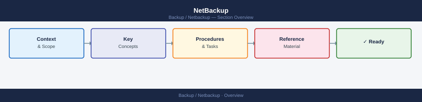

---
tags:
  - netbackup
---
# NetBackup

Veritas NetBackup enterprise backup — three-tier architecture with Primary Server catalog, Media Servers for data movement, and MSDP deduplication with AIR image replication.

*Applies to: NetBackup 10.x*

<a class="kb-card" href="architecture/">
  <strong>Architecture</strong>
  Three-tier topology, Primary Server catalog, Media Servers, MSDP dedup, and key processes.
</a>

<a class="kb-card" href="deploy/">
  <strong>Deploy</strong>
  Installation, initial configuration, and deployment procedures.
</a>

<a class="kb-card" href="operations/">
  <strong>Operations</strong>
  CLI reference, health checks, procedures, lifecycle, and scripts.
</a>

<a class="kb-card" href="security/">
  <strong>Security</strong>
  Authentication, access control, encryption, and hardening.
</a>

<a class="kb-card" href="troubleshooting/">
  <strong>Troubleshooting</strong>
  Common issues, diagnostics, and escalation.
</a>

