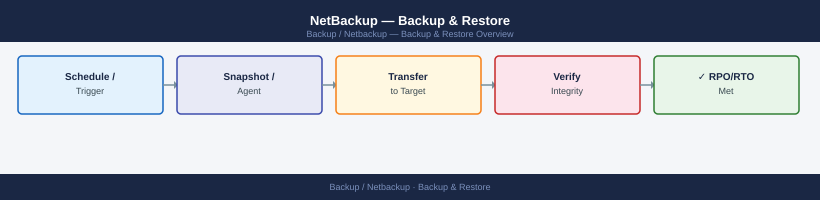
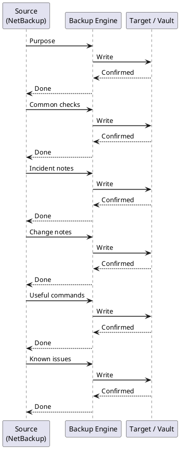

---
tags:
  - netbackup
  - operations
---
# NetBackup — Backup & Restore

Backup & Restore reference covering Purpose, Common checks, Incident notes, Change notes, Useful commands and 2 more sections.

*Applies to: NetBackup 10.x*

## Before you begin

- **Access:** Backup admin role on backup server; target system credentials
- **Timing:** safe to run during business hours unless a step is marked ⚠ (causes interruption)
- **Dependencies:** no active upgrades or migrations on the same infrastructure
- **Logging:** capture command output — paste into the change record on completion

---

## Purpose

Use this page for practical NetBackup Restores notes, checks, troubleshooting, commands, change notes, and field references.

## Common checks

- Confirm current health
- Review active alerts
- Check recent changes
- Confirm dependencies
- Check logs, events, and monitoring
- Capture current state before changes

## Incident notes

Capture:

- Symptom
- Start time
- Impact
- System or service name
- Error message
- What changed
- What was checked
- Next action

## Change notes

- Confirm change approval
- Confirm maintenance window
- Confirm rollback plan
- Capture current state
- Make one change at a time
- Validate after the change

## Useful commands

Add tested commands here.

## Known issues

Add known issues here as they come up.

## Catalog

### MSDP Architecture and Dedup Pool Flow

Use this section for practical NetBackup Catalog notes, checks, troubleshooting, commands, change notes, and field references.

### Common checks

- Confirm current health
- Review active alerts
- Check recent changes
- Confirm dependencies
- Check logs, events, and monitoring
- Capture current state before changes

### Incident notes

Capture:

- Symptom
- Start time
- Impact
- System or service name
- Error message
- What changed
- What was checked
- Next action

### Change notes

- Confirm change approval
- Confirm maintenance window
- Confirm rollback plan
- Capture current state
- Make one change at a time
- Validate after the change

### Useful commands

Add tested commands here.

### Known issues

Add known issues here as they come up.

---

## Verify

- **Job status:** confirm backup job completed with status Success (not Warning)
- **Recovery test:** restore a single file or VM from the new backup to confirm restorability
- **Retention:** verify old recovery points are expiring per the configured retention policy

---

## See also

- [Netbackup — Procedures](../procedures/)
- [Netbackup — Health Checks](../health-checks/)
- [Netbackup — Common Issues](../../troubleshooting/common-issues/)
