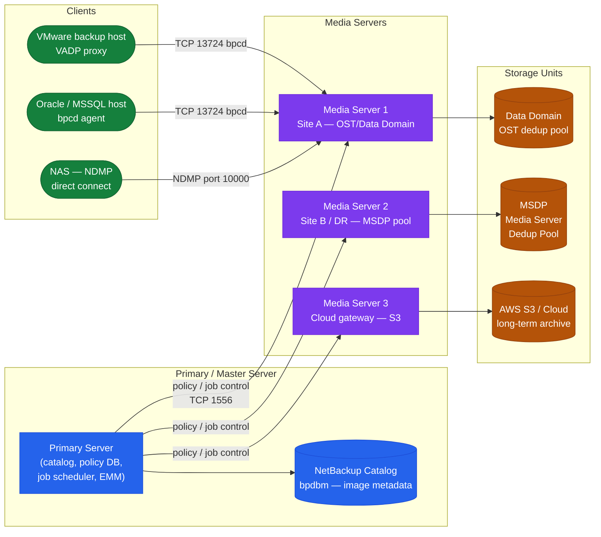

---
tags:
  - netbackup
  - operations
---
# NetBackup CLI Reference

<div class="kb-summary">
NetBackup CLI Reference reference covering Master → Media → Client Topology, Restore Operations, Catalog & Media, Client & Policy Management, Error & Log Analysis.

*Applies to: NetBackup 10.x*
</div>

## Before you begin

- **Access:** Backup admin role on backup server; target system credentials
- **Timing:** safe to run during business hours unless a step is marked ⚠ (causes interruption)
- **Dependencies:** no active upgrades or migrations on the same infrastructure
- **Logging:** capture command output — paste into the change record on completion

---

## Master → Media → Client Topology

Understanding the three-tier topology is essential before using the CLI — commands execute at the correct tier.



Run restores from the CLI. Always verify client name, backup time, and policy before executing.

```bash
# Restore files for a client
bprestore -C <client> -t <policy_type> -L /tmp/restore.log <file_path>

# List available restore points (backup images)
bpimmedia -U -client <client>

# Browse backups for a client
bplist -C <client> -t <type> -R /

# Initiate instant access restore
bprestore -L /tmp/restore.log -R -C <client> <path>
```


```text title="Expected output"
bprestore -C prod-web-01 -t Standard -L /tmp/restore.log /home/appuser/data
Restore Request ID: RID-2024-001847
Status: SUBMITTED
Estimated completion: 2024-01-15 14:32:00

bpimmedia -U -client prod-web-01
Image ID                          Policy       Backup Date         Size (GB)
IMG-20240115-084521               Standard     2024-01-15 08:45    245.3
IMG-20240114-084501               Standard     2024-01-14 08:45    248.7
IMG-20240113-084512               Standard     2024-01-13 08:45    251.2
IMG-20240112-084530               Standard     2024-01-12 08:45    243.9

bplist -C prod-web-01 -t Standard -R /
/home/appuser/data/config.xml
/home/appuser/data/app.log
/home/appuser/data/cache/
/var/lib/appdata/
...
Total files: 1247

bprestore -L /tmp/restore.log -R -C prod-web-01 /home/appuser/data
Instant Access Restore initiated
Mount point: /mnt/nbu_instant_20240115_prod-web-01
Status: MOUNTED
Access available for: 7 days
```

!!! warning "Common errors"
    **`bprestore: Client 'prod-web-01' not found in policy`** — Verify the client name matches exactly in the NetBackup policy configuration using `bppllist -l`.
    **`bpimmedia: No images found for client within retention period`** — Confirm backups exist for the specified client and check retention policies haven't expired the required image.
    **`bprestore: Permission denied writing to /tmp/restore.log`** — Ensure the NetBackup daemon user has write permissions to the log directory or specify an alternate writable path.
---

## Catalog & Media

Manage media, catalog verification, and storage unit health.

```bash
# List all storage units
bpstulist

# List storage unit detail
bpstulist -label <stu_name>

# List media volumes
vmquery -b -m <media_id>

# List all tape drives
tpconfig -d

# Run catalog backup
bpcatarc

# Verify catalog integrity
bpdbm -consistency_check
```


```text title="Expected output"
Storage Units:
  STU_PRIMARY_001 (disk)
  STU_SECONDARY_002 (tape)
  STU_ARCHIVE_003 (disk)

Storage Unit: STU_PRIMARY_001
  Type: disk
  Path: /netbackup/storage/primary
  Capacity: 2.0 TB
  Used: 1.2 TB

Media ID: CLN001234
  Status: Active
  Location: Vault_A
  Last_Used: 2024-01-15 14:32:00
  Remaining_Capacity: 450 GB

Tape Drives:
  Drive_001: /dev/rmt/0 (LTO9, Online)
  Drive_002: /dev/rmt/1 (LTO9, Online)
  Drive_003: /dev/rmt/2 (LTO8, Offline)

Catalog backup started: 2024-01-15 15:45:22
Backup completed successfully
Catalog size: 12.4 GB

Consistency check: PASSED
Database integrity verified
Check completed: 2024-01-15 15:47:18
```

!!! warning "Common errors"
    **`bpstulist: command not found`** — Ensure NetBackup bin directory is in PATH: `export PATH=$PATH:/usr/openv/netbackup/bin`
    **`vmquery: Media ID not found`** — Verify the media ID exists and is not expired by running `vmquery -b` without the `-m` flag first.
    **`bpdbm: Consistency check FAILED - 3 errors detected`** — Run `bpdbm -rebuild_catalog` to repair the database, then re-run the consistency check.
---

## Client & Policy Management

Inspect and manage client records and policy assignments.

```bash
# List all clients
bpclient -L

# Show detail for a specific client
bpclient -L -client <name>

# Test BPCD connectivity to a client
bptestbpcd -client <host>

# Test client backup connectivity
bptestnetconn -sv -client <host>

# List media servers
nbemmcmd -listhosts -machinetype mediaserver
```


```text title="Expected output"
bpclient -L
apollo-web-01
apollo-db-02
apollo-app-03
apollo-cache-01
apollo-backup-gw
5 clients listed

bpclient -L -client apollo-web-01
Client Name: apollo-web-01
Platform: Linux
OS Version: Red Hat Enterprise Linux 8.7
Last Backup: 2024-01-15 22:45:33
Status: Active

bptestbpcd -client apollo-web-01
Connected to BPCD on apollo-web-01 (192.168.45.12:13782)
BPCD Version: 9.1.0.1
Connection Status: OK

bptestnetconn -sv -client apollo-web-01
Testing connectivity from backup server to apollo-web-01...
TCP port 13782 (BPCD): OPEN
TCP port 13783 (BPCD SSL): OPEN
Network connectivity: SUCCESS

nbemmcmd -listhosts -machinetype mediaserver
apollo-media-01 (192.168.50.10)
apollo-media-02 (192.168.50.11)
apollo-media-03 (192.168.50.12)
3 media servers found
```

!!! warning "Common errors"
    **`bpclient: client not found`** — Verify the client hostname matches exactly in NetBackup Admin Console and check DNS resolution with `nslookup <hostname>`.
    **`bptestbpcd: connection refused on port 13782`** — Ensure the BPCD daemon is running on the client with `ps aux | grep bpcd` and firewall rules allow port 13782 from the master server.
    **`nbemmcmd: invalid option or command not found`** — Confirm you are running this command on the NetBackup master server and that the NetBackup binaries are in your PATH with `which nbemmcmd`.
---

## Error & Log Analysis

Decode errors and review logs.

```bash
# Show backup errors from last 24 hours
bperror -backstat -hoursago 24

# Look up an error code
bperror -S <exit_status>

# View unified logs (unilog format)
vxlogview -i 51216 -d 24:00:00

# Tail legacy job logs
tail -f /usr/openv/netbackup/logs/bprd/log.<today>
```


```text title="Expected output"
bperror -backstat -hoursago 24
Backup Status Report - Last 24 Hours
=====================================
Host              Policy          Status    Time            Size(GB)
backup-prod-01    daily_full      FAILED    2024-01-15 03:45    2048.5
backup-prod-02    daily_incr      COMPLETED 2024-01-15 04:12    512.3
backup-dev-01     weekly_full     FAILED    2024-01-15 02:30    1024.0
backup-prod-03    daily_full      COMPLETED 2024-01-15 05:00    4096.2
Total Errors: 2

bperror -S 1
Exit Status: 1
Description: The requested operation was partially successful
Recommendation: Check individual job logs for details

vxlogview -i 51216 -d 24:00:00
[2024-01-15 03:45:22] INFO: Backup job 12847 initiated for backup-prod-01
[2024-01-15 03:47:15] WARN: Network timeout on secondary path, retrying
[2024-01-15 03:52:08] ERROR: Media mount failed - tape drive offline
[2024-01-15 04:12:33] INFO: Backup job 12848 completed successfully
[2024-01-15 05:00:01] INFO: Cleanup phase started

tail -f /usr/openv/netbackup/logs/bprd/log.20240115
01/15/2024 03:45:22 - bprd[1234]: Job 12847 started
01/15/2024 03:47:15 - bprd[1234]: Connection established to backup-prod-01
01/15/2024 03:52:08 - bprd[1234]: ERROR - Cannot access /dev/rmt/0 (Device busy)
01/15/2024 04:12:33 - bprd[1235]: Job 12848 completed, status=0
```

!!! warning "Common errors"
    **`vxlogview: invalid instance ID 51216`** — Verify the correct instance ID with `vxlogview -l` and use a valid ID from the output.
    **`tail: cannot open '/usr/openv/netbackup/logs/bprd/log.20240115' for reading: No such file or directory`** — Replace `<today>` with the actual date in YYYYMMDD format (e.g., `log.20240115`) or use `ls /usr/openv/netbackup/logs/bprd/` to find available log files.
---

## Verify

- **Job status:** confirm backup job completed with status Success (not Warning)
- **Recovery test:** restore a single file or VM from the new backup to confirm restorability
- **Retention:** verify old recovery points are expiring per the configured retention policy

---

## See also

- [Netbackup — Procedures](../procedures/)
- [Netbackup — Scripts](../scripts/)
- [Netbackup — Health Checks](../health-checks/)
